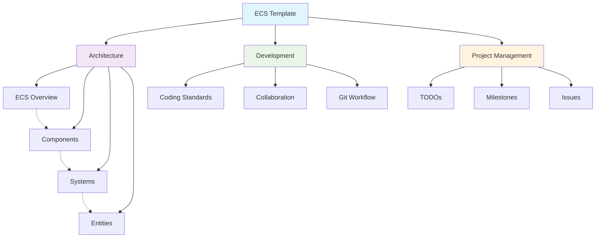

# Godot 2D Game ECS Template Documentation

> 基于Godot 4.5的2D游戏ECS（Entity-Component-System）架构模板项目

## 🎯 Project Overview

本项目是一个基于Godot 4.5的2D游戏ECS（Entity-Component-System）架构模板项目，专为GMTK GameJam 2025准备的开源仓库。项目采用经典的ECS设计模式，通过组件组合的方式实现游戏实体的各种功能，提供了高度模块化和可扩展的游戏开发框架。

### ✨ Core Features

- **ECS架构设计**：清晰的职责分离，高度可复用性，便于扩展和维护
- **组件化开发**：基础组件和接口组件分离，支持运行时动态添加/移除组件
- **策略模式**：移动策略、相机策略、状态策略等多种策略模式实现
- **混合状态机**：HFSM + PDA的混合状态机架构，支持层次化和状态记忆
- **完整存档系统**：递归收集、类型安全、版本兼容的数据持久化机制
- **UI管理系统**：HUD预加载、UI单例模式、状态联动的完整界面管理
- **地图管理**：楼层按需激活、动态实体管理、缓存系统的大型世界管理
- **开发工具集成**：实时命令行、调试支持、非阻塞设计的开发工具

### 🛠️ Technical Specifications

- **Engine Version**: Godot 4.5 beta3
- **Platform Support**: MacOS, Windows, Linux
- **Architecture Pattern**: Entity-Component-System (ECS)
- **Development Language**: GDScript
- **Core Files**: 66个注释完整的核心文件

---

## 🧭 Navigation Menu

### 🚀 Quick Links

- [[Quick Start Guide]] - 快速开始指南
- [[Installation Guide]] - 安装指南
- [[ECS Architecture Overview]] - ECS架构概述

### 📚 Documentation Sections

#### 🏗️ Architecture Documentation #Architecture

- [[ECS Architecture Overview]] - ECS架构总体设计
- [[Entity System]] - 实体系统详解
- [[Component System Architecture]] - 组件系统详解
- [[System Architecture]] - 系统架构详解

#### 👥 Development Documentation #Development

- [[Coding Standards]] - 编码规范
- [[Collaboration Guidelines]] - 协作指南
- [[Git Workflow]] - Git工作流程
- [[Asset Creation Guide]] - 素材制作规范

#### 📖 User Guides #Guides

- [[Quick Start Guide]] - 快速开始指南
- [[Installation Guide]] - 安装指南
- [[Best Practices]] - 最佳实践

#### 📚 Reference Documentation #References

- [[Component Catalog]] - 组件目录
- [[System Catalog]] - 系统目录
- [[File Structure]] - 文件结构
- [[API Reference]] - API参考

#### 📊 Project Management #ProjectMgmt

- [[TODO Lists]] - 任务列表
- [[Project Milestones]] - 里程碑
- [[Issues & Bugs]] - 问题跟踪
- [[Changelog]] - 更新日志

---

## 📈 Recent Updates

### 2024-12 Latest Changes

- ✅ README.md完整重构，基于66个核心文件的注释结构
- ✅ 栈溢出递归问题修复（详见 [[debug_recursion_fix.md]]）
- ✅ 项目注释添加完成（详见 [[项目注释添加报告.md]]）
- ✅ 组件文档大幅更新，反映重大架构变化
- ✅ 移动系统重构文档更新，从独立组件到行为动作
- ✅ 组件重命名更新（C_Collision→C_CollisionBox等）
- ✅ 状态机系统文档更新，包含玩家状态实现
- ✅ C_ActionTrigger组件文档更新，反映新的行为系统
- ✅ TriggerAction接口完善，提供详尽的使用指南
- ✅ 类型安全强化，Dictionary强类型声明和类型转换优化
- 🆕 Orgmode文档结构设计完成
- 🆕 Obsidian知识库创建完成

---

## 📊 Project Statistics

```dataview
TABLE WITHOUT ID
  file.name as "分类",
  length(file.tags) as "标签数量",
  file.size as "文件大小"
FROM ""
WHERE contains(file.path, "docs_md")
SORT file.name ASC
```

| 分类 | 数量 | 描述 |
|------|------|------|
| 核心架构文件 | 3 | Entity, Component, System基类 |
| 核心管理系统 | 10 | 游戏状态、黑板、控制器等系统 |
| 组件模块 | 13+ | 输入、移动、碰撞、状态等组件 |
| UI系统 | 2 | UI基类和HUD基类 |
| 工具类 | 2 | 常量和事件工具 |
| 总注释文件 | 66 | 完整注释的核心文件 |

---

## 🔍 Knowledge Graph



---

## 🏷️ Tags Overview

#ECS #Component #System #Entity #Architecture #Development #GameDev #Godot #Template #GMTK2025

### Tag Categories

- **架构标签**: #ECS #Component #System #Entity
- **开发标签**: #Development #Coding #Collaboration #Git
- **功能标签**: #UI #Audio #Movement #Collision #State
- **管理标签**: #TODO #Milestone #Issue #Bug

---

## 📞 Contact Information

- **主要架构师**: Sora
- **GitHub**: [项目仓库链接]
- **问题报告**: 使用GitHub Issues
- **讨论交流**: 使用GitHub Discussions

---

## 🔗 Quick Navigation

### 常用文档快速链接

| 文档类型 | 链接 | 描述 |
|----------|------|------|
| 架构说明 | [[ECS Architecture Overview]] | ECS核心架构设计 |
| 开发规范 | [[Collaboration Guidelines]] | 团队协作和编码规范 |
| 组件目录 | [[Component Catalog]] | 66个组件的详细说明 |
| 任务管理 | [[TODO Lists]] | 项目任务和进度跟踪 |
| 里程碑 | [[Project Milestones]] | 项目阶段和目标 |

---

*最后更新: 2024年12月*  
*文档版本: 3.0 (Obsidian知识库版)*

> [!tip] 使用提示
> 这是一个活跃维护的知识库，随着项目的发展会持续更新。  
> 建议定期查看最新版本以获取最新信息。  
> 使用Obsidian的图谱视图可以更好地理解文档间的关系。
