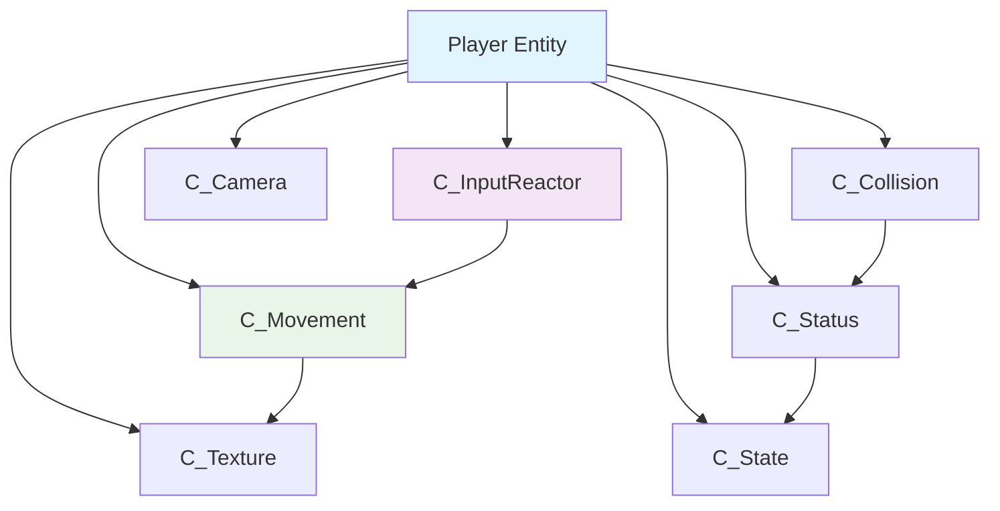
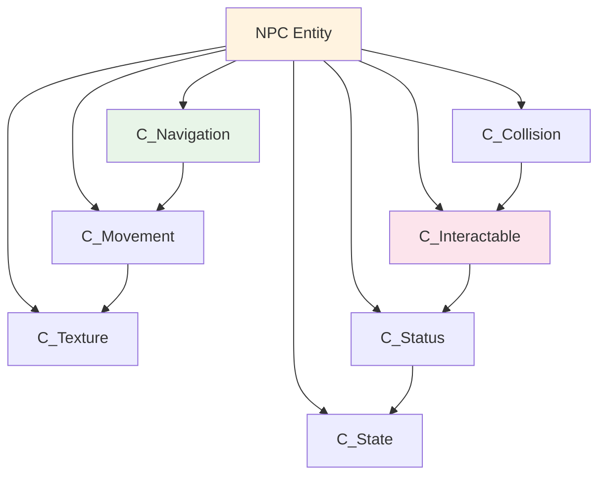

# Component System Architecture

组件系统是ECS架构的核心组成部分，提供了高度模块化和可复用的功能实现。本项目包含13+个主要组件模块，每个组件都遵循单一职责原则。

## 🧩 组件基类

- **文件路径**: `component/i_component.gd`
- **设计理念**: 提供统一的组件接口和生命周期管理
- **核心特性**: 黑板数据共享、动态加载、状态管理

```gdscript
class_name IComponent extends Node

@export var component_name: String
var blackboard: ContainerBlackboard

func component_init() -> void: pass
func component_reset() -> void: pass
```

---

## 🎮 控制相关组件 #Control

### C_InputReactor - 输入响应组件 #Input

处理用户输入，支持多种移动模式和交互管理。

- **文件路径**: `component/c_input_reactor/`
- **主要功能**: 处理用户输入，支持多种移动模式和交互对象管理
- **适用场景**: 玩家控制、AI输入模拟、交互触发

#### 核心特性
- 🕹️ **多种移动模式**: 横版、四向、八向、全向移动
- 🎯 **交互对象管理**: 维护当前可交互对象列表
- 🔧 **可扩展架构**: 支持输入响应扩展系统

#### 移动模式配置
| 模式类型 | 枚举值 | 描述 |
|----------|--------|------|
| HORIZONTAL | 0 | 横版移动（左右） |
| FOUR_DIRECTION | 1 | 四向移动（上下左右） |
| EIGHT_DIRECTION | 2 | 八向移动（包含斜向） |
| ALL_DIRECTION | 3 | 全向移动（360度） |

#### 扩展系统
- [[UIPanelOpenExtension]] - UI面板开启
- [[MouseFocusExtension]] - 鼠标焦点跟随
- [[RayInteractConfirmExtension]] - 射线交互确认

### C_NavigationAgent - 导航代理组件 #Navigation

AI寻路和动态路径规划系统。

- **文件路径**: `component/c_navigation_agent/`
- **主要功能**: 基于Godot NavigationAgent2D的AI寻路和导航
- **适用场景**: NPC导航、敌人追踪、自动巡逻

#### 导航模式
- **STOP**: 停止导航
- **PAUSE**: 暂停导航（保持当前目标）
- **TRACK**: 跟踪导航（动态更新目标位置）
- **LOCATED**: 定点导航（导航到固定位置）

#### 导航特性
- 🗺️ **路径规划**: 基于导航网格的路径计算
- 🎯 **目标跟踪**: 动态目标追踪和预测
- 🔄 **路径更新**: 实时路径重计算和优化

---

## 🎨 视觉相关组件 #Visual

### C_TextureController - 纹理控制器组件 #Texture

纹理和动画管理系统。

- **文件路径**: `component/c_texture_controller/`
- **主要功能**: 纹理和动画管理，支持多种精灵类型
- **支持类型**: Sprite2D, AnimatedSprite2D, Sprite + AnimationPlayer

#### 纹理管理特性
- 🖼️ **多格式支持**: 静态纹理和动画纹理
- 🎬 **动画控制**: 播放、暂停、循环控制
- 📦 **资源优化**: 纹理缓存和预加载机制

#### 打包纹理系统
- [[IPackedSprite]] - 打包精灵接口，定义统一的精灵处理标准

### C_Camera - 相机组件 #Camera

相机控制系统，支持多种跟随策略。

- **文件路径**: `component/c_camera/`
- **主要功能**: 相机控制系统，支持多种跟随策略
- **设计模式**: Strategy Pattern

#### 跟随策略
- [[CameraFollowMouseStrategy]] - 鼠标跟随相机策略（类似孤胆枪手）
- **扩展支持**: 可添加平滑跟随、预测跟随等策略

### C_Balloon - 气泡组件 #Balloon

UI气泡效果，支持动态显示和动画。

- **文件路径**: `component/c_balloon/`
- **主要功能**: UI气泡效果，支持动态显示和动画
- **适用场景**: 对话气泡、提示信息、状态显示

#### 气泡特性
- 💬 **动态显示**: 根据内容自动调整大小
- 🎭 **动画效果**: 淡入淡出、缩放动画
- 🎯 **定位系统**: 自动跟随目标实体

---

## 💥 碰撞检测组件 #Collision

### C_CollisionBox - 碰撞盒组件

碰撞检测管理，支持多种碰撞盒类型和射线检测。

- **文件路径**: `component/c_collision_box/`
- **主要功能**: 多类型碰撞盒管理和射线检测
- **架构设计**: 基于BoxCollision的专业化碰撞系统

#### 碰撞类型

##### HitBox - 攻击判定盒 #HitBox
- **功能**: 处理伤害输出和攻击检测
- **特性**: 伤害计算、攻击范围、命中反馈

##### HurtBox - 受伤判定盒 #HurtBox
- **功能**: 处理伤害接收和防御计算
- **特性**: 防御计算、无敌时间、受伤反馈

##### InteractBox - 交互碰撞盒 #InteractBox
- **功能**: 实体间交互检测
- **特性**: 交互范围、触发条件、对象过滤

##### SightBox - 视觉检测盒 #SightBox
- **功能**: AI视觉感知系统
- **特性**: 多形状支持、视野角度、遮挡检测

#### 射线检测系统
- [[InteractRay]] - 基于射线检测的精确交互系统

### 碰撞架构特色

#### ⚔️ 完整战斗系统
- HitBox和HurtBox的协同工作
- 伤害计算和防御机制
- 攻击反馈和受伤表现

#### 👁️ AI视觉系统
- 多形状视野检测（圆形、扇形、矩形）
- 视线遮挡计算
- 目标优先级排序

#### 🎯 精确交互
- 区域检测和射线检测的双重机制
- 类型过滤和群组管理
- 交互距离和角度限制

---

## 🤝 交互相关组件 #Interaction

### C_Interactable - 交互组件

复杂交互系统，支持主动和被动交互。

- **文件路径**: `component/c_interactable/`
- **主要功能**: 复杂交互系统，支持主动和被动交互
- **设计模式**: Strategy Pattern

#### 交互模式

##### 主动交互
- 需要玩家按键确认
- 显示交互提示UI
- 支持交互条件检查

##### 被动交互
- 自动触发交互
- 基于区域进入/离开
- 支持延迟和冷却

#### 交互行为类型

##### InteractionDialogue - 对话交互 #Dialogue
- **功能**: 与NPC或其他实体的对话功能
- **集成**: 与DialogueManager深度集成

##### InteractionTransport - 传送交互 #Transport
- **功能**: 实体在不同场景间的传送
- **特性**: 跨楼层传送、位置记录、过渡动画

##### InteractionCollect - 拾取交互 #Collect
- **功能**: 物品自动收集和拾取
- **集成**: 与背包系统深度集成

#### 交互配置
- [[InteractionRecord]] - 交互配置资源，存储交互设置

---

## 📊 状态管理组件 #Status

### C_StatusList - 状态列表组件

状态管理，包含动态状态和静态数值管理。

- **文件路径**: `component/c_status_list/`
- **主要功能**: 状态管理，包含动态状态和静态数值管理
- **扩展支持**: 支持状态扩展系统（Buff/Debuff）

#### 状态类型

##### StatusInfo - 动态状态管理 #StatusInfo
- **用途**: 生命值、魔力值等动态变化的数值
- **特性**: 当前值、最大值、变化回调

##### NumInfo - 静态数值管理 #NumInfo
- **用途**: 攻击力、防御力等相对静态的数值
- **特性**: 基础值、修正值、计算缓存

#### 状态扩展系统

##### StatusExtension - 状态扩展基类
- **功能**: 为状态组件提供复杂状态管理的扩展机制

##### BuffListExtension - Buff系统扩展 #Buff
- **功能**: 管理实体的临时效果和状态修改器
- **特性**: 时间管理、堆叠机制、效果计算

##### InventoryExtension - 背包系统扩展 #Inventory
- **功能**: 提供物品存储和管理功能
- **特性**: 容量管理、物品分类、装备系统

### C_StateMachine - 状态机组件 #StateMachine

层次化状态机，支持HFSM和PDA混合模式。

- **文件路径**: `component/c_state_machine/`
- **主要功能**: 层次化状态机，支持HFSM和PDA混合模式
- **架构特色**: 混合状态机架构，结合层次化和状态记忆

#### 状态机类型

##### HFSM - 层次化有限状态机 #HFSM
- **功能**: 支持多层嵌套的复合状态机实现
- **特性**: 状态嵌套、并发状态、历史状态

##### PDA - 下推自动机 #PDA
- **功能**: 状态栈管理，支持状态历史保存和恢复
- **特性**: 状态压栈、弹出、回滚操作

#### 混合状态实现
- [[StateHfsm]] - 混合层次化和下推自动机的复合状态

#### 具体状态示例
- [[GamingStateNormal]] - 游戏正常进行状态
- [[GamingStatePause]] - 游戏暂停状态  
- [[StateIdlePlayer]] - 玩家空闲状态

---

## ⚡ 行为控制组件 #Behavior

### C_ActionTrigger - 行为触发组件 #Action

管理实体的定时行为和特殊动作，支持模组化的行为逻辑。

- **文件路径**: `component/c_action_trigger/`
- **主要功能**: 行为触发管理，包括移动、攻击、技能等所有行为
- **适用场景**: 玩家移动、AI行为、技能释放、定时事件

#### ⚡ 重要架构变化：移动系统重构

**移动功能现在通过行为动作实现，不再是独立组件**:

##### 新的移动行为
- **MoveVector**: 向量移动行为，取代了原来的C_Movement组件
- **MoveStrategyStraight**: 直线移动行为，用于子弹等高速对象

##### 架构优势
- 🎯 **统一行为管理**: 移动、攻击、技能等统一管理
- 🔧 **灵活组合**: 可以动态添加、移除不同行为
- 📊 **状态追踪**: 统一的行为状态管理

#### 行为系统
- [[IAction]] - 实体行为基类，定义可执行行为的抽象接口
- [[IUpdateAction]] - 持续更新行为基类，支持状态检测和持续逻辑
- [[TriggerAction]] - 触发行为基类，一次性执行的行为如技能、道具使用
- **核心特性**: 信号驱动、类型安全、状态管理、生命周期完整

#### 行为分类
- **持续行为**: 移动、状态检测等需要持续更新的行为
- **触发行为**: 技能释放、道具使用等一次性触发的行为
- **定时行为**: 基于时间记录的自动触发行为

### C_Marker - 标记组件 #Marker

空间标记系统，用于导航和定位。

- **文件路径**: `component/c_marker/`
- **主要功能**: 空间标记系统，用于导航和定位
- **适用场景**: 路径点、生成点、传送点

#### 标记类型
- [[BoxMarker]] - 区域标记，定义特定功能区域

---

## 🔄 组件协作模式

### 🔗 数据共享机制
- **容器黑板**: 实体内组件间的数据共享
- **信号通信**: 基于Signal的事件驱动通信
- **直接引用**: 关键组件间的直接数据访问

### ⚙️ 生命周期管理
1. **组件初始化** (`component_init`): 组件加载时调用
2. **组件重置** (`component_reset`): 游戏重置时调用
3. **组件销毁**: 自动内存管理和资源清理

### 🎯 组件组合模式

#### 典型玩家实体组合


#### 典型NPC实体组合


---

## 🚀 组件扩展指南

### 新组件开发流程
1. **继承基类**: 从 `IComponent` 继承
2. **定义功能**: 实现特定功能逻辑
3. **添加接口**: 提供外部调用接口
4. **测试验证**: 编写测试用例验证功能
5. **文档更新**: 更新相关文档和示例

### 最佳实践建议
- **单一职责**: 每个组件只负责一个明确的功能
- **低耦合**: 通过黑板和信号实现组件间通信
- **高内聚**: 相关功能集中在同一组件内
- **可配置**: 通过导出变量提供配置选项

### 扩展系统利用
- 利用现有扩展系统添加新功能
- 通过策略模式实现行为变化
- 使用模板方法模式标准化流程

---

## 📈 组件性能优化建议

### 组件启用/禁用
- 不需要的组件及时禁用，减少不必要的计算
- 使用组件的 `set_process()` 和 `set_physics_process()` 控制更新

### 对象池化 #ObjectPool
- 频繁创建销毁的组件使用对象池
- 特别适用于子弹、特效、UI元素等

### 数据缓存 #Cache
- 状态组件中的计算结果进行缓存
- 避免每帧重复计算相同的数值

### 组件通信优化 #Communication
- 优先使用直接引用而非信号查找
- 减少不必要的信号连接和断开

---

## 🔗 Related Documents

- [[ECS Architecture Overview]] - ECS架构概述
- [[System Architecture]] - 系统架构详解
- [[Entity System]] - 实体系统详解
- [[Component Catalog]] - 组件详细目录
- [[Coding Standards]] - 编码规范

---

## 📝 Notes

> [!info] 组件设计理念
> 组件系统是ECS架构的核心，通过高度模块化的设计实现功能的灵活组合，
> 为游戏开发提供了强大的扩展性和可维护性。

> [!tip] 使用建议
> - 合理组合组件实现复杂功能
> - 利用扩展系统增加新特性
> - 注意组件间的依赖关系
> - 定期检查组件性能表现

---

#Component #Architecture #ECS #GameDev
