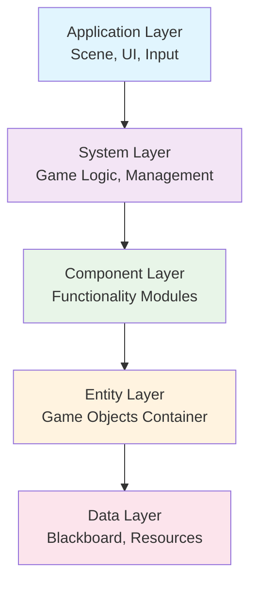

# ECS Architecture Overview

本项目采用经典的Entity-Component-System（ECS）架构模式，这是一种高度模块化和可扩展的游戏架构设计方法。

## 🏗️ ECS核心概念

### Entity（实体） #Entity

实体是游戏世界中对象的基本容器，本身不包含任何逻辑或数据，仅作为组件的载体。

- **基类文件**: `entity/i_entity.gd`
- **功能**: 作为组件的容器和唯一标识符
- **特性**: 轻量级、无状态、可复用

```gdscript
## 实体基类示例
class_name IEntity extends Node2D

@export var entity_id: String
var components: Dictionary = {}
```

### Component（组件） #Component

组件包含特定的数据和功能，定义了实体的各种属性和行为能力。

- **基类文件**: `component/i_component.gd`
- **设计原则**: 单一职责、高内聚、低耦合
- **组件分类**: 
  - 控制组件（输入、移动、导航）
  - 视觉组件（纹理、相机、气泡）
  - 检测组件（碰撞、交互）
  - 状态组件（状态机、数值、行为）

```gdscript
## 组件基类示例  
class_name IComponent extends Node

@export var component_name: String
var blackboard: ContainerBlackboard
```

### System（系统） #System

系统处理具有特定组件组合的实体，实现游戏的核心逻辑和业务流程。

- **基类文件**: `system/i_system.gd`
- **职责**: 组件逻辑处理、系统间协调、生命周期管理
- **系统类型**:
  - 核心管理系统
  - 功能处理系统
  - 工具辅助系统

```gdscript
## 系统基类示例
class_name ISystem extends Node

func system_init() -> void: pass
func system_reset() -> void: pass
```

---

## 🎯 架构设计原则

### 🧩 组合优于继承
通过组件组合而非类继承实现功能扩展，提供更高的灵活性和可维护性。

### 📦 单一职责原则
每个组件和系统都有明确定义的单一职责，避免功能耦合。

### 🔄 数据驱动设计
通过数据配置而非硬编码实现行为变化，支持运行时动态调整。

### ⚡ 高性能考虑
合理使用对象池、缓存机制和延迟加载，确保游戏性能。

---

## 🏛️ 架构层次结构



---

## ⚙️ 核心管理系统

本项目包含10个核心管理系统，按依赖关系有序初始化：

### 系统列表

| 系统名称 | 文件路径 | 主要功能 | 优先级 |
|----------|----------|----------|--------|
| [[SGameState]] | `system/s_game_state/` | 游戏状态机管理 | 1 |
| [[SBlackboard]] | `system/s_blackboard/` | 全局数据共享 | 2 |
| [[SMainController]] | `system/s_main_controller/` | 主控制器协调 | 3 |
| [[SSignalBus]] | `system/s_signal_bus/` | 全局信号总线 | 4 |
| [[SMapData]] | `system/s_map_data/` | 地图数据管理 | 5 |
| [[SAudioMaster]] | `system/s_audio_master/` | 音频总线管理 | 6 |
| [[SLoadAndSave]] | `system/s_load_save/` | 存档系统管理 | 7 |
| [[SUiSpawner]] | `system/s_ui_spawner/` | UI管理系统 | 8 |
| [[SGlobalConfig]] | `system/s_global_config/` | 全局配置管理 | 9 |
| [[SCommandParser]] | `system/s_command_parser/` | 命令行解析器 | 10 |

---

## 🗄️ 数据流架构

### 分层数据管理

#### 🌐 全局黑板 (SBlackboard) #Blackboard
- **作用域**: 系统级数据共享
- **内容**: 游戏状态、全局配置、系统间通信数据
- **访问方式**: 单例模式，全局可访问

#### 📦 容器黑板 (ContainerBlackboard) #Container
- **作用域**: 实体级数据共享
- **内容**: 组件间通信数据、实体状态信息
- **访问方式**: 实体内部共享，组件间通信

#### 💾 存档系统 (SLoadAndSave) #SaveLoad
- **作用域**: 持久化数据管理
- **内容**: 游戏进度、用户设置、实体状态
- **特性**: 类型安全、版本兼容、增量支持

---

## 🎨 设计模式应用

### 🎯 策略模式 (Strategy Pattern) #Strategy

广泛应用于行为变化的场景：

#### 移动策略 #Movement
- [[MoveStrategy]] - 基类
- [[MoveVector]] - 向量移动策略，支持输入控制和AI控制
- [[MoveStraight]] - 直线移动策略，用于子弹等高速移动对象

#### 相机策略 #Camera
- [[CameraFollowStrategy]] - 基类
- [[CameraFollowMouseStrategy]] - 鼠标跟随

#### 状态策略 #State
- 层次化有限状态机 (HFSM)
- 下推自动机 (PDA)
- 混合状态机实现

### 🏭 工厂模式 (Factory Pattern) #Factory
- UI和实体的动态创建
- 组件的运行时实例化
- 资源的统一管理

### 🔍 观察者模式 (Observer Pattern) #Observer
- 基于Signal的事件驱动架构
- 系统间的解耦通信
- 状态变化的响应机制

---

## 🔧 扩展系统设计

通过扩展系统实现功能的模块化：

### 输入扩展系统 #Input
- [[ReactorExtension]] - 基类
- [[UIPanelOpenExtension]] - UI面板触发
- [[MouseFocusExtension]] - 鼠标焦点
- [[RayInteractConfirmExtension]] - 射线交互确认

### 行为系统设计 #Action
- [[IAction]] - 行为基类，定义可执行行为的抽象接口，支持统一的初始化和执行流程
- [[IUpdateAction]] - 更新行为基类，需要持续更新的行为，如移动、状态检测等
- [[TriggerAction]] - 触发行为基类，一次性触发行为，如技能释放、道具使用等
- [[MoveVector]] - 向量移动行为，取代原C_Movement组件，支持输入控制和AI控制
- [[MoveStrategyStraight]] - 直线移动行为，用于高速对象如子弹、投射物等
- [[TimeRecord]] - 时间记录，定时行为的时间配置，支持精确的时间触发

### 移动行为架构 #Movement
> **架构变化**: 移动不再是独立组件，而是作为行为动作实现

#### 新的移动模式
- **输入控制移动**: 通过CInputReactor获取玩家输入
- **AI控制移动**: 通过代码直接设置移动向量
- **高速直线移动**: 专为子弹、投射物设计的临时移动

### 状态扩展系统 #Status
- [[StatusExtension]] - 基类
- [[BuffListExtension]] - Buff系统
- [[InventoryExtension]] - 背包系统

---

## ⚡ 性能优化策略

### 🔄 对象池机制 #ObjectPool
- 频繁创建销毁的对象使用对象池
- 减少GC压力，提升运行时性能

### 📊 数据缓存 #Cache
- 计算结果缓存，避免重复计算
- 资源预加载，减少运行时加载延迟

### ⚡ 延迟加载 #LazyLoad
- 非关键资源延迟加载
- 按需激活地图区域，优化内存使用

### 🎯 组件优化 #Optimization
- 组件的启用/禁用机制
- 基于需求的组件动态添加/移除

---

## 🚀 架构扩展性

### 新组件添加

1. 继承 `IComponent` 基类
2. 实现特定功能逻辑
3. 注册到组件系统
4. 更新相关文档

### 新系统集成

1. 继承 `ISystem` 基类
2. 实现系统初始化逻辑
3. 添加到系统启动序列
4. 配置系统间依赖关系

### 自定义扩展

- 利用扩展系统添加新功能
- 通过策略模式实现行为变化
- 使用黑板系统实现数据共享

---

## 🔗 Related Documents

- [[Component System Architecture]] - 组件系统详解
- [[System Architecture]] - 系统架构详解  
- [[Entity System]] - 实体系统详解
- [[Coding Standards]] - 编码规范
- [[Component Catalog]] - 组件目录
- [[System Catalog]] - 系统目录

---

## 📝 Notes

> [!note] ECS架构核心
> ECS架构的核心在于组合优于继承，通过灵活的组件组合实现复杂的游戏功能，
> 同时保持代码的可维护性和可扩展性。

> [!tip] 最佳实践
> - 保持组件的单一职责
> - 使用数据驱动的设计
> - 合理利用对象池和缓存
> - 通过扩展系统实现功能模块化

---

#ECS #Architecture #GameDev #Design
