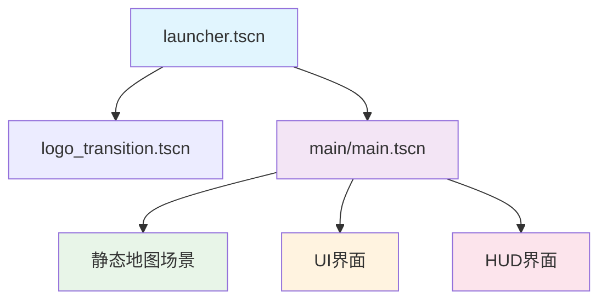
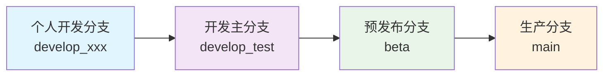

# Collaboration Guidelines

本文档定义了团队协作开发的标准规范，确保代码质量和开发效率。所有开发者都应严格遵循这些规范。

---

## 📝 脚本编辑规范 #Coding

### 注释标签系统 #Tags

#### 必需标签 #Required

##### `## @editing:` 主要编辑者标识
- **用途**: 标明当前脚本的主要编辑者和维护责任人
- **规则**: 主要编辑者确定后，若要切换编辑者，必须要得到原编辑者的确定方可修改
- **格式**: `## @editing: 编辑者名称`

```gdscript
## @editing: Sora
class_name ExampleClass
```

##### `## @describe:` 功能说明
- **用途**: 写明该脚本的主要功能和用处
- **要求**: 简洁明确地描述脚本的核心职责
- **格式**: `## @describe: 功能描述`

```gdscript
## @describe: 玩家输入处理组件，支持多种移动模式和交互管理
class_name CInputReactor extends IComponent
```

##### `## @filename:` 文件关联
- **适用**: 未使用`class_name`语句的脚本（一般是仅限于实现类）
- **用途**: 标注脚本文件与实现场景的关联关系
- **格式**: `## @filename: 脚本文件名 --> 实现场景`

```gdscript
## @filename: player_controller.gd --> player_entity.tscn
```

#### 可选标签 #Optional

##### `#region :编辑者名称: 代码功能说明`
- **用途**: 由后编辑者编写，标明region框选代码部分的作者和功能
- **要求**: 具体说明插入部分代码的用途，方便主要编辑者进行功能鉴定与维护

```gdscript
#region :Umo: 新建一个保留用的新函数
func new_func():
    ## 新增功能的具体实现
    pass
#endregion
```

##### `## BETA` 功能冻结标识
- **用途**: 明确说明当前部分代码功能冻结，除bug修复外不允许插入新的逻辑
- **管理**: 由主要编辑者对代码的新增逻辑进行维护，并评定筛选后编辑者PR的代码
- **清理**: 在完成评定后将审查后的代码去除标注用的`#region`注释，替换为`## `注释

### 标准脚本模板 #Template

```gdscript
## BETA
## @editing: Sora
## @describe: 测试用的类，展示ECS组件的标准实现
## @filename: example_component.gd --> example_entity.tscn
class_name ExampleComponent extends IComponent

@export var example_property: String ## 示例属性，用于配置组件行为

## 组件初始化方法
## @description: 在组件加载时调用，进行必要的初始化
func component_init() -> void:
    super.component_init()
    print("ExampleComponent initialized")

#region :Umo: 新建一个保留用的新函数
## 新增功能函数
## @description: 后编辑者添加的功能实现
func new_func():
    pass
#endregion

## 组件重置方法
## @description: 在游戏重置时调用，恢复组件到初始状态
func component_reset() -> void:
    super.component_reset()
    print("ExampleComponent reset")
```

---

## 🎬 场景编辑规范 #Scene

### 编辑权限管理 #Permissions

#### 📋 任务分配原则
- 使用 **TodoManager** 插件管理场景编辑任务
- 通过 **Kanban** 插件明确说明场景文件的编辑者
- 不同时间段，同一个场景只可允许 **一个人** 进行编辑

#### ⏰ 编辑时间管理
- 在开始编辑场景前，必须在Kanban中声明编辑意图
- 编辑完成后，及时更新任务状态
- 长期编辑（超过2小时）需要定期提交进度

#### 📞 协调机制
- 紧急需要修改他人正在编辑的场景时，必须先进行沟通
- 通过项目群组或直接联系获得编辑权限
- 保存好当前进度，避免工作冲突

### 场景组织规范 #Organization

#### 🧩 组件化设计
- 场景的组织应当高度遵循场景规范
- 尽量使用已经存在的子场景进行组合
- 避免重复创建相似功能的场景节点

#### 📁 场景分类

| 场景类型 | 目录位置 | 命名规范 | 用途 |
|----------|----------|----------|------|
| 启动场景 | scene/launcher/ | launcher_*.tscn | 游戏启动和初始化 |
| 游戏地图 | scene/static_map/ | m_地图名称.tscn | 静态地图场景 |
| 实体模板 | entity/entity_packed/ | entity_*.tscn | 实体预制体 |
| UI界面 | ui/ | ui_*/hud_*.tscn | 用户界面 |

#### 🔗 场景依赖关系



---

## 🌿 GitHub分支规范 #Git

### 分支架构 #Branches

#### 主要分支

##### `main` 分支 #Production
- **用途**: 最终合并的正式版本，生产环境部署分支
- **权限**: 仅限项目管理员进行合并操作
- **质量**: 必须通过完整测试，确保稳定性

##### `beta` 分支 #Staging
- **用途**: dev版本的规范化合并分支，预发布版本
- **特点**: 用于规范化dev阶段的内容，保证协作的效果
- **管理**: 在下一轮之前以注释关键字的方式冻结代码

##### `develop_test` 分支 #Development
- **用途**: 开发版本主分支，集成测试分支
- **要求**: 每个协作成员应当勤合并至此分支
- **管理**: 定期进行集成测试和冲突解决

#### 个人开发分支

##### `develop_xxx` 个人分支 #Personal
- **命名**: `develop_` + 个人名称（建议与`@editing:`使用的名字一致）
- **基础**: 在`develop_test`版本的基础上进行开发
- **同步**: 定期与`develop_test`保持同步，避免冲突积累

### 合并工作流程 #Workflow

#### 标准合并路径



#### 合并前检查清单 #Checklist

- [ ] 代码符合编码规范
- [ ] 所有注释标签完整
- [ ] 通过基本功能测试
- [ ] 无明显的性能问题
- [ ] 与目标分支无冲突

### 提交规范 #Commits

#### ⏰ 提交频率
- 以 **半个小时** 为基准进行一次代码的提交与合并
- 重要功能完成后立即提交
- 每日至少进行一次代码提交

#### 📝 提交消息格式

##### 个人分支提交格式
```
测试提交3_Sora: <本次提交的内容与修复的功能>
```

##### Beta分支提交格式
```
冻结提交3: <本次修复的功能>
```

##### Main分支提交格式
```
提交3: <本次提交的内容与修复的功能>
```

#### 提交消息模板

##### 功能开发 #Feature
```
feat_Sora: 实现玩家移动组件的四向移动功能

- 添加四向移动输入处理
- 实现移动速度配置
- 完善组件注释文档
```

##### Bug修复 #BugFix
```
fix_Sora: 修复状态机递归调用导致的栈溢出问题

- 移除信号循环调用
- 添加状态值变化检查
- 优化状态更新逻辑
```

##### 文档更新 #Docs
```
docs_Sora: 更新ECS架构文档和组件使用说明

- 完善组件目录文档
- 添加使用示例代码
- 修正文档格式问题
```

---

## 🎯 任务管理规范 #TaskMgmt

### TodoManager插件使用 #Todo

#### TODO关键字规范
- `TODO`: 待完成的功能或任务
- `FIXME`: 需要修复的问题
- `HACK`: 临时解决方案，需要后续优化
- `NOTE`: 重要说明或注意事项
- `BUG`: 已知但未修复的问题

#### TODO注释格式
```gdscript
## TODO_Sora: 实现玩家攻击动画系统
func player_attack():
    pass  ## FIXME_Umo: 临时实现，需要完善伤害计算

## NOTE: 此处的移动速度需要根据地形进行调整
@export var move_speed: float = 100.0

## HACK_Sora: 使用临时方案解决相机抖动问题，后续需要重构
func fix_camera_shake():
    pass
```

### Kanban任务跟踪 #Kanban

#### 任务状态分类

| 状态 | 含义 | 操作者 |
|------|------|--------|
| Backlog | 待规划任务 | 项目负责人 |
| To Do | 待开始任务 | 任务分配者 |
| In Progress | 进行中任务 | 任务执行者 |
| Review | 待审查任务 | 代码审查者 |
| Done | 已完成任务 | 任务执行者 |

#### 任务卡片规范
- **标题**: 简洁明确的任务描述
- **负责人**: 任务执行者（与@editing保持一致）
- **截止时间**: 预期完成时间
- **依赖关系**: 前置任务或依赖资源
- **优先级**: High/Medium/Low

### 进度报告机制 #Progress

#### 每日站会 #Daily
- **时间**: 每日固定时间（建议上午）
- **内容**: 昨日完成、今日计划、遇到问题
- **方式**: 线上会议或文字报告

#### 周进度汇报 #Weekly
- **内容**: 本周完成任务、下周计划、风险识别
- **格式**: 结构化报告文档
- **存档**: 保存在项目管理文档中

---

## 🔍 代码审查规范 #CodeReview

### 审查触发条件 #Triggers

#### 必须审查的情况
- 新功能完整实现
- 重要bug修复
- 架构性修改
- 公共组件修改
- 核心系统变更

#### 可选审查的情况
- 文档更新
- 注释完善
- 小型bug修复
- 个人开发分支内的WIP提交

### 审查检查项目 #ReviewList

#### 📝 代码质量检查
- [ ] 代码符合项目编码规范
- [ ] 注释完整且准确
- [ ] 无明显的性能问题
- [ ] 错误处理适当
- [ ] 变量命名清晰

#### 🏗️ 架构合规检查
- [ ] 遵循ECS架构原则
- [ ] 组件职责清晰
- [ ] 系统间耦合度合理
- [ ] 数据流向正确

#### 🧪 功能测试检查
- [ ] 核心功能正常运行
- [ ] 边界条件处理正确
- [ ] 无回归问题
- [ ] 性能表现可接受

### 审查反馈机制 #Feedback

#### 反馈分类
- **Must Fix**: 必须修复的问题，阻止合并
- **Should Fix**: 应该修复的问题，建议合并前处理
- **Nice to Have**: 可选改进，不影响合并
- **Question**: 询问或讨论，需要澄清

#### 反馈格式
```
[Must Fix] 第45行：缺少空指针检查，可能导致运行时错误
[Should Fix] 第67行：变量名不够清晰，建议重命名为更描述性的名称
[Nice to Have] 第89行：可以考虑提取为常量，提高可维护性
[Question] 第123行：这里为什么选择这种实现方式？
```

---

## 📢 沟通协调规范 #Communication

### 沟通渠道 #Channels

#### 主要沟通方式

| 沟通类型 | 推荐渠道 | 使用场景 |
|----------|----------|----------|
| 日常讨论 | 项目群组 | 一般性问题讨论 |
| 技术讨论 | GitHub Discussions | 技术方案讨论 |
| 问题报告 | GitHub Issues | Bug报告和功能请求 |
| 紧急协调 | 直接联系 | 紧急问题和冲突解决 |

#### 响应时间要求
- **紧急问题**: 2小时内响应
- **一般问题**: 24小时内响应  
- **讨论议题**: 48小时内响应
- **文档更新**: 一周内响应

### 会议规范 #Meetings

#### 例会安排
- **每日站会**: 15分钟，进度同步
- **周例会**: 60分钟，问题讨论和计划调整
- **里程碑会议**: 120分钟，阶段性总结和规划

#### 会议记录
- 所有会议需要有会议记录
- 记录决议和行动项
- 24小时内分发给所有参与者
- 存档在项目文档中

---

## 📋 质量保证规范 #QA

### 测试要求 #Testing

#### 基本测试
- **功能测试**: 核心功能正常运行
- **集成测试**: 组件间协作正常
- **回归测试**: 修改不影响现有功能
- **性能测试**: 满足基本性能要求

#### 测试文档
- 测试用例文档
- 测试结果记录
- 问题跟踪列表
- 性能基准数据

### 发布准备 #Release

#### 发布前检查
- [ ] 所有功能完整实现
- [ ] 通过完整测试套件
- [ ] 文档更新完成
- [ ] 版本号正确标记
- [ ] 发布说明准备完成

#### 发布流程
1. **合并到beta分支**: 进行最终测试
2. **生成发布版本**: 创建release tag
3. **更新文档**: 包括CHANGELOG
4. **通知团队**: 发布完成通知

---

## 🔗 Related Documents

- [[Coding Standards]] - 编码规范详细说明
- [[Git Workflow]] - Git工作流程指南  
- [[Asset Creation Guide]] - 素材制作规范
- [[TODO Lists]] - 任务管理系统
- [[Project Milestones]] - 项目里程碑

---

## 📝 Notes

> [!info] 协作规范目的
> 良好的协作规范是项目成功的基础。
> 严格遵循这些规范，可以确保代码质量，提高开发效率，避免不必要的冲突。

> [!tip] 执行建议
> - 将规范文档加入收藏，便于随时查阅
> - 定期回顾和更新协作流程
> - 新成员入队时进行规范培训
> - 持续改进协作效率

> [!warning] 重要提醒
> - 主要编辑者权限变更需要原编辑者同意
> - 场景文件同时只能有一人编辑
> - 代码提交前必须进行基本测试

---

#Collaboration #Guidelines #TeamWork #Development
