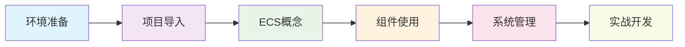
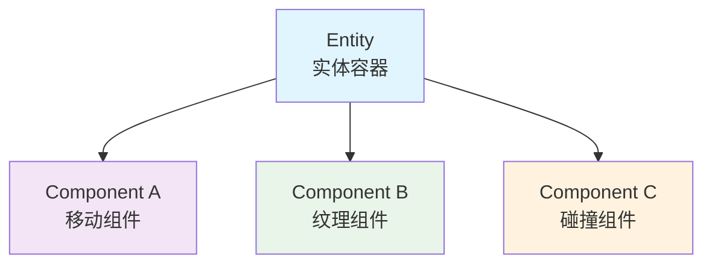
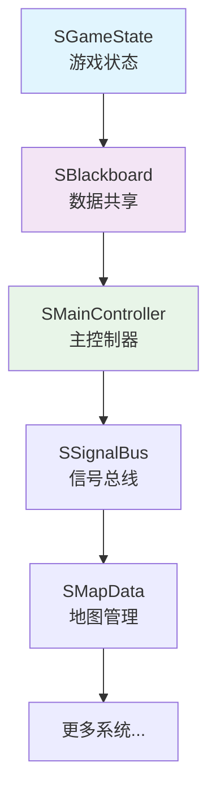

# Quick Start Guide

欢迎使用Godot 2D Game ECS Template！本指南将帮助您快速上手项目，了解核心概念，并开始您的游戏开发之旅。

## 🎯 学习路径



## 🔧 环境准备

### 前置要求

- **Godot 引擎**: 4.5 beta3 或更高版本
- **操作系统**: MacOS, Windows, 或 Linux
- **开发经验**: 基本的GDScript知识（推荐）
- **硬件要求**: 4GB RAM，2GB可用磁盘空间

### 获取项目

1. **克隆项目**
```bash
git clone <repository-url>
cd Godot-2D-Game-ECS-Template/ECS
```

2. **或下载ZIP包**
   - 从GitHub下载项目ZIP文件
   - 解压到您的工作目录

## 📦 项目导入

### 使用Godot打开项目

1. 启动Godot引擎
2. 点击"导入项目"按钮
3. 浏览并选择项目根目录中的 `project.godot` 文件
4. 点击"导入并编辑"

### 验证项目导入

- 检查文件系统面板中是否显示完整的项目结构
- 运行项目（F5键）确认能正常启动
- 查看输出面板确认无错误信息

---

## 🏗️ ECS核心概念 #ECS

### 什么是ECS？

ECS（Entity-Component-System）是一种架构模式，将游戏对象分解为三个核心概念：

#### Entity（实体） #Entity


- **定义**: 游戏世界中对象的基本容器
- **特点**: 轻量级，仅作为组件载体
- **基类**: [[IEntity]] (`entity/i_entity.gd`)

#### Component（组件） #Component
- **定义**: 包含特定数据和功能的模块
- **原则**: 单一职责，高内聚，低耦合
- **基类**: [[IComponent]] (`component/i_component.gd`)
- **分类**: 控制、视觉、碰撞、状态、行为

#### System（系统） #System
- **定义**: 处理组件逻辑的管理器
- **职责**: 组件协调、业务流程、生命周期管理
- **基类**: [[ISystem]] (`system/i_system.gd`)

### ECS优势

> [!tip] ECS架构优势
> - **灵活性**: 通过组合实现复杂功能
> - **可维护性**: 清晰的职责分离
> - **可扩展性**: 易于添加新功能
> - **性能**: 缓存友好的数据组织

---

## 🧩 创建第一个实体

让我们创建一个简单的玩家实体来学习ECS的使用：

### 1. 创建实体场景

1. 在Godot编辑器中，创建新场景
2. 添加 `Node2D` 作为根节点，重命名为 `Player`
3. 添加 `IEntity` 脚本组件

```gdscript
extends Node2D
class_name Player

## 玩家实体
## @editing: YourName
## @describe: 游戏玩家角色实体，包含移动、纹理、输入等功能

@export var player_id: String = "player_001"
```

### 2. 添加组件

#### 输入响应组件
```gdscript
# 添加输入处理
var input_component = preload("res://component/c_input_reactor/c_input_reactor.tscn").instantiate()
input_component.movement_type = SoraConstant.MovementType.FOUR_DIRECTION
add_child(input_component)
```

#### 移动组件
```gdscript
# 添加移动功能
var movement_component = preload("res://component/c_movement/c_movement.tscn").instantiate()
movement_component.move_speed = 150.0
add_child(movement_component)
```

#### 纹理组件
```gdscript
# 添加视觉显示
var texture_component = preload("res://component/c_texture/c_texture.tscn").instantiate()
texture_component.texture_type = C_Texture.TextureType.ANIMATED_SPRITE
add_child(texture_component)
```

### 3. 保存和测试

1. 保存场景为 `player_entity.tscn`
2. 在主场景中实例化玩家实体
3. 运行游戏测试移动功能

---

## ⚙️ 系统管理 #System

### 核心系统介绍

项目包含10个核心管理系统，自动按顺序初始化：



### 系统使用示例

#### 访问全局数据
```gdscript
# 通过黑板系统共享数据
SBlackboard.set_value("player_score", 1000)
var score = SBlackboard.get_value("player_score")
```

#### 发送全局信号
```gdscript
# 通过信号总线通信
SSignalBus.emit_signal("player_died", player_data)
```

#### 管理游戏状态
```gdscript
# 切换游戏状态
SGameState.change_state("pause")
```

---

## 🎮 实战示例：创建NPC

让我们创建一个完整的NPC实体来巩固学习：

### 1. NPC实体设计

```gdscript
extends Node2D
class_name NPCGuard

## @editing: YourName  
## @describe: 守卫NPC，具有对话功能和基本AI

func _ready():
    _setup_components()

func _setup_components():
    # 添加纹理组件
    var texture_comp = C_Texture.new()
    texture_comp.current_animation = "idle"
    add_child(texture_comp)
    
    # 添加碰撞组件（用于对话检测）
    var collision_comp = C_Collision.new()
    var interact_box = InteractBox.new()
    interact_box.interaction_types = ["npc"]
    collision_comp.add_collision_box("interact", interact_box)
    add_child(collision_comp)
    
    # 添加交互组件
    var interact_comp = C_Interactable.new()
    var dialogue_interaction = InteractionDialogue.new()
    dialogue_interaction.dialogue_resource = load("res://resource/plugins_resource/dialogue/guard_dialogue.dialogue")
    interact_comp.passive_interaction = dialogue_interaction
    add_child(interact_comp)
```

### 2. 创建对话资源

1. 在 `resource/plugins_resource/dialogue/` 创建 `guard_dialogue.dialogue`
2. 使用DialogueManager插件编辑对话内容：

```
~ start

守卫: 你好，旅行者！欢迎来到这里。
- 我需要帮助
    守卫: 什么事情？我会尽力帮助你的。
    => start
- 告辞
    守卫: 一路平安！
    => END
```

### 3. 测试NPC功能

1. 将NPC添加到测试场景
2. 让玩家走近NPC触发对话
3. 验证对话系统正常工作

---

## 📚 进阶学习 #Advanced

### 深入学习资源

1. **架构文档**
   - [[ECS Architecture Overview]] - 深入了解ECS设计
   - [[Component System Architecture]] - 组件系统详解
   - [[System Architecture]] - 系统架构说明

2. **组件参考**
   - [[Component Catalog]] - 完整组件API参考
   - 浏览 `component/` 文件夹查看所有可用组件

3. **开发规范**
   - [[Collaboration Guidelines]] - 团队协作规范
   - [[Coding Standards]] - 编码标准

### 实践建议

> [!tip] 学习建议
> 1. **从简单开始**: 先熟悉基本的实体-组件组合
> 2. **逐步复杂**: 慢慢添加更多组件和功能
> 3. **阅读源码**: 查看现有组件的实现代码
> 4. **实验试错**: 不怕犯错，多做尝试
> 5. **参考示例**: 查看项目中的示例实体

---

## 🚀 下一步行动

### 立即可做的事情

- [ ] 创建您的第一个自定义实体
- [ ] 尝试不同的组件组合
- [ ] 修改现有组件的参数
- [ ] 创建简单的游戏场景
- [ ] 阅读更详细的架构文档

### 进阶目标

- [ ] 创建自定义组件
- [ ] 实现自己的游戏逻辑
- [ ] 优化性能和内存使用
- [ ] 参与项目开发和贡献
- [ ] 为GMTK GameJam做准备

---

## 🆘 获取帮助

### 问题解决

1. **查看文档**: 首先查阅相关的架构和组件文档
2. **搜索代码**: 使用Godot编辑器的搜索功能查找相似实现
3. **查看示例**: 项目中包含多个示例实体和场景
4. **调试输出**: 使用 `print()` 语句调试代码执行流程

### 社区支持

- **GitHub Issues**: 报告bug和请求功能
- **GitHub Discussions**: 技术讨论和经验分享
- **项目Wiki**: 查看更多文档和教程

---

## 📝 Notes

> [!info] 快速开始总结
> 本指南涵盖了使用ECS模板的基本流程，从环境设置到创建第一个实体。
> ECS架构可能需要一些时间来适应，但一旦掌握，将为您的游戏开发带来巨大的灵活性。

> [!tip] 持续学习
> - 定期查阅项目文档的更新
> - 尝试分析现有的复杂实体实现
> - 参与开源项目的开发和讨论
> - 分享您的经验和创作

---

#Guide #QuickStart #Tutorial #ECS #Beginner
