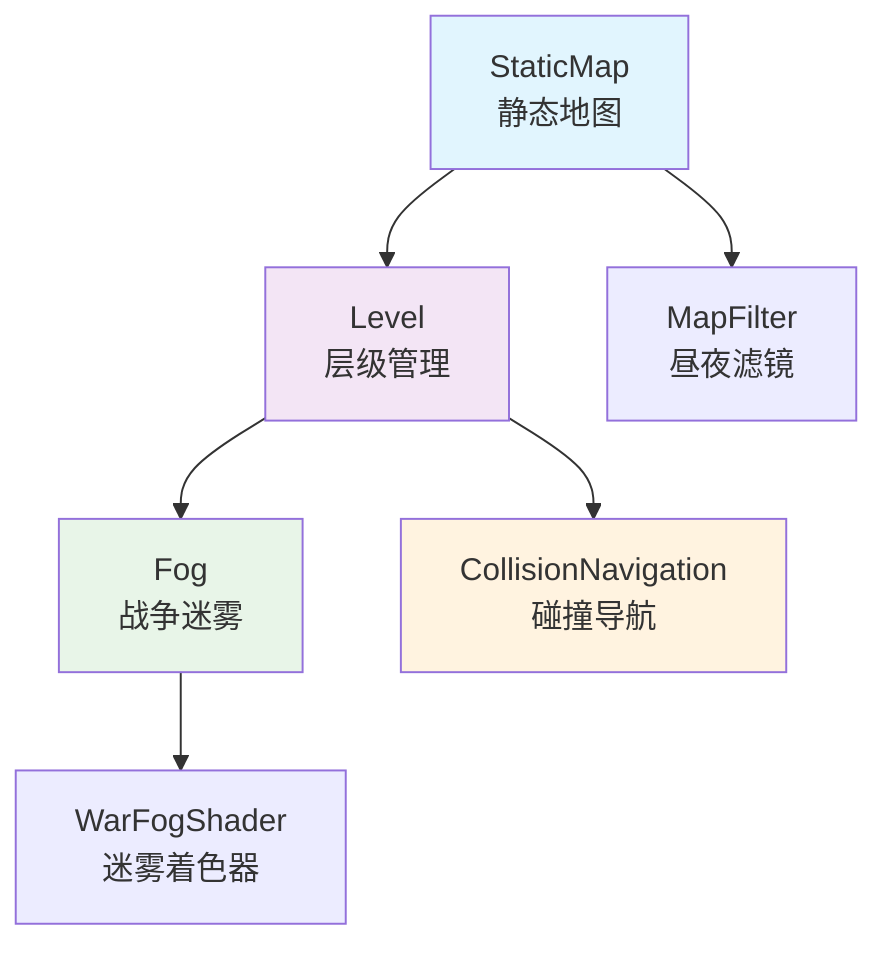
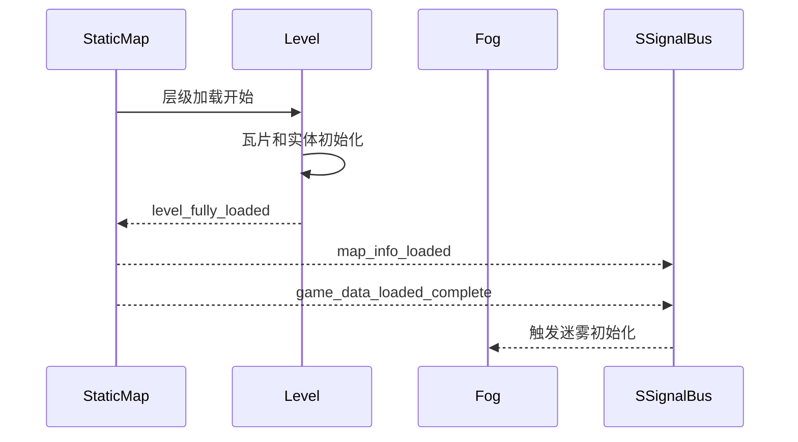

# 文档更新总结 - 地图系统

本文档总结了基于地图系统代码变化的文档重新整理工作。

## 📋 更新概览

### 🎯 更新目标
根据目前地图系统相关文件的变化，重新整理项目文档内容，确保文档与代码实现保持一致。

### 📂 涉及的核心文件
- `resource/node_template/map/static_map/fog.gd` - 战争迷雾系统
- `resource/node_template/map/level.gd` - 地图层级系统  
- `resource/node_template/map/level.tscn` - 层级场景文件
- `resource/node_template/map/war_fog.gdshader` - 战争迷雾着色器

---

## ✅ 完成的工作

### 1. 📖 创建地图系统专项文档
**文件**: `docs/docs_md/systems/Map System Architecture.md`

**内容包含**:
- **StaticMap系统**: 静态地图管理、昼夜循环、异步加载机制
- **Level系统**: 层级管理、楼层级碰撞导航、性能优化
- **Fog系统**: 战争迷雾、动态视野、实时图像处理
- **着色器系统**: WarFog Shader、双纹理混合、GPU加速渲染
- **系统集成**: 信号通信、生命周期管理、存档支持

**技术亮点**:


### 2. 🔧 更新组件目录文档
**文件**: `docs/docs_md/references/Component Catalog.md`

**新增章节**: `🗺️ 地图系统组件`
- StaticMap - 静态地图系统
- Level - 层级管理系统
- Fog - 战争迷雾系统
- 地图着色器系统
- 地图系统与ECS的设计模式

**集成说明**:
- 系统级组件与ECS组件的协作模式
- 数据流向和通信机制
- 性能优化和使用建议

### 3. 📝 更新主README文档
**文件**: `docs/docs_md/README.md`

**核心功能更新**:
```gdscript
// 旧版本
- **地图管理**：楼层按需激活、动态实体管理、缓存系统的大型世界管理

// 新版本  
- **地图管理系统**：多层级地图结构、楼层级碰撞导航、战争迷雾视野系统
- **战争迷雾系统**：基于玩家位置的动态视野、实时图像处理、着色器优化渲染
- **昼夜循环**：时间驱动的视觉滤镜、渐变纹理映射、动态环境效果
```

**最新更新记录**:
- 🆕 **地图系统架构完整实现**，包含静态地图、层级管理、战争迷雾
- 🆕 **战争迷雾系统**，实时图像处理、着色器优化、动态视野管理
- 🆕 **楼层级碰撞导航**，多层建筑的智能碰撞管理和性能优化
- 🆕 **昼夜循环系统**，基于时间的动态视觉滤镜和环境效果

---

## 🏗️ 地图系统架构要点

### 🎯 核心特性

#### 1. StaticMap - 静态地图系统
```gdscript
## 核心功能
- 多层级地图结构组织
- 异步分层加载机制  
- 昼夜循环视觉滤镜
- 传送点全局管理
- 过场剧情自动化
```

#### 2. Level - 层级管理系统
```gdscript
## 核心功能
- 楼层级碰撞导航控制
- 瓦片图层协调加载
- 实体初始化状态管理
- 对象池临时实体管理
- 相机边界限制设置
```

#### 3. Fog - 战争迷雾系统
```gdscript
## 核心功能
- 基于玩家位置的动态视野
- 实时图像混合处理
- 性能优化的移动检测
- 着色器加速渲染
- 持久化探索记录
```

#### 4. 着色器系统
```glsl
// WarFog Shader - 双纹理混合
shader_type canvas_item;
uniform vec4 fog_color: source_color;
uniform sampler2D current_texture;

void fragment(){
    COLOR.rgb = fog_color.rgb;
    COLOR.a = (texture(TEXTURE, UV).r + texture(current_texture, UV).r) / 2.0;
}
```

### 🔄 系统协作模式

#### 加载序列


#### 性能优化
- **楼层隔离**: 禁用非当前楼层的碰撞检测
- **按需更新**: 基于玩家移动状态的动态迷雾更新
- **着色器加速**: GPU处理图像混合和渲染
- **内存管理**: 图像数据复用和缓存机制

---

## 🎨 技术亮点

### 1. 🌫️ 战争迷雾算法
```gdscript
## 动态视野更新算法
func update_fog():
    # 1. 坐标系转换
    var player_local_pos = player_world_pos - fog_world_origin + Vector2(0, -20)
    
    # 2. 光源位置计算 (居中对齐)
    var light_position = player_local_pos - Vector2(light_size.x / 2, light_size.y / 2)
    
    # 3. 边界限制 (防越界)
    light_position.x = clamp(light_position.x, 0, fog_size.x - light_size.x)
    light_position.y = clamp(light_position.y, 0, fog_size.y - light_size.y)
    
    # 4. 实时图像混合
    fog_image.blend_rect(light_image, Rect2i(Vector2.ZERO, light_size), Vector2i(light_position))
    
    # 5. 双纹理更新
    fog_texture.update(fog_image)      # 持久迷雾纹理
    current_texture.update(current_image)  # 当前光照纹理
```

### 2. 🏢 楼层级碰撞管理
```gdscript
## 智能碰撞控制系统
func enable_all_collision_navigation():
    _process_all_collision_navigation_recursive(self, true)
    show()
    collision_navigation_enabled = true

func disable_all_collision_navigation():
    _process_all_collision_navigation_recursive(self, false)
    hide()
    collision_navigation_enabled = false

## 支持的节点类型
- CharacterBody2D/RigidBody2D/StaticBody2D: 物理体碰撞
- Area2D: 区域检测监听
- CollisionShape2D/CollisionPolygon2D: 碰撞形状
- TileMapLayer: 瓦片地图碰撞
- NavigationRegion2D/Agent2D/Obstacle2D: 导航系统
```

### 3. 🌅 昼夜循环系统
```gdscript
## 时间驱动的视觉滤镜
func time_change_filter(point: float):
    _update_filter(point)  # 避免递归调用

func _update_filter(time_value: float):
    if map_filter and filter_gradient:
        # 基于梯度纹理的颜色插值
        map_filter.color = filter_gradient.gradient.sample(time_value)
```

---

## 📈 项目提升

### 🎯 功能完善度
- **地图管理**: 从基础楼层管理提升到完整的多层级地图系统
- **视觉效果**: 增加战争迷雾、昼夜循环等沉浸式体验功能
- **性能优化**: 楼层级碰撞管理和着色器加速渲染
- **开发体验**: 完整的API文档和使用指南

### 🔧 技术架构
- **系统集成**: 地图系统与ECS组件的无缝协作
- **数据管理**: 完整的存档支持和状态持久化
- **扩展性**: 支持复杂地图结构和自定义扩展
- **维护性**: 清晰的代码注释和文档结构

### 📚 文档体系
- **系统文档**: 新增专项地图系统架构文档
- **组件目录**: 扩展地图系统组件说明
- **快速导航**: 更新主文档的功能描述和导航链接
- **技术细节**: 包含算法实现、性能优化、使用示例

---

## 🔮 未来展望

### 📊 潜在扩展
- **动态地图**: 支持运行时地图生成和修改
- **多人同步**: 地图状态的网络同步机制
- **视觉特效**: 更多环境特效和后处理效果
- **性能监控**: 地图系统性能分析和优化工具

### 🎮 游戏应用
- **RPG游戏**: 多层地牢、城镇、野外地图
- **策略游戏**: 战争迷雾、地形影响、资源管理
- **探索游戏**: 渐进式地图揭示、区域解锁
- **模拟游戏**: 昼夜循环、环境变化、时间系统

---

## 📝 总结

本次文档更新工作成功地将地图系统的代码变化反映到项目文档中，提供了：

✅ **完整的系统文档**: 详细的地图系统架构说明  
✅ **技术实现细节**: 算法原理和性能优化方案  
✅ **使用指南**: 配置方法和集成示例  
✅ **与ECS集成**: 系统级组件与ECS组件的协作模式  
✅ **项目导航**: 更新主文档的功能描述和快速链接

这些文档更新确保了项目的技术文档与代码实现保持同步，为开发者提供了完整、准确、易用的参考资料。

---

#Documentation #Update #MapSystem #Summary #Architecture

