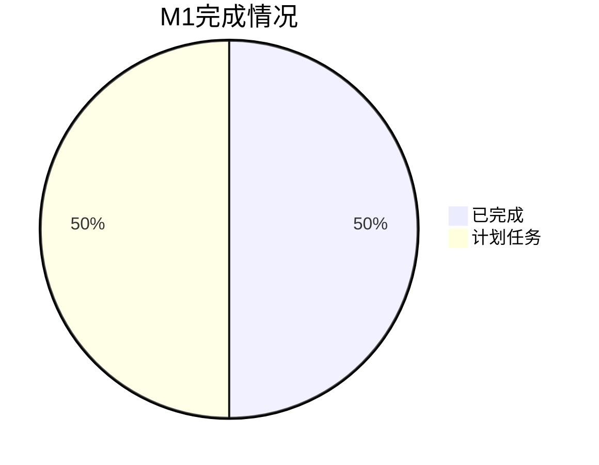
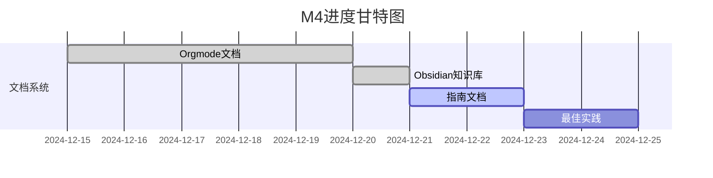
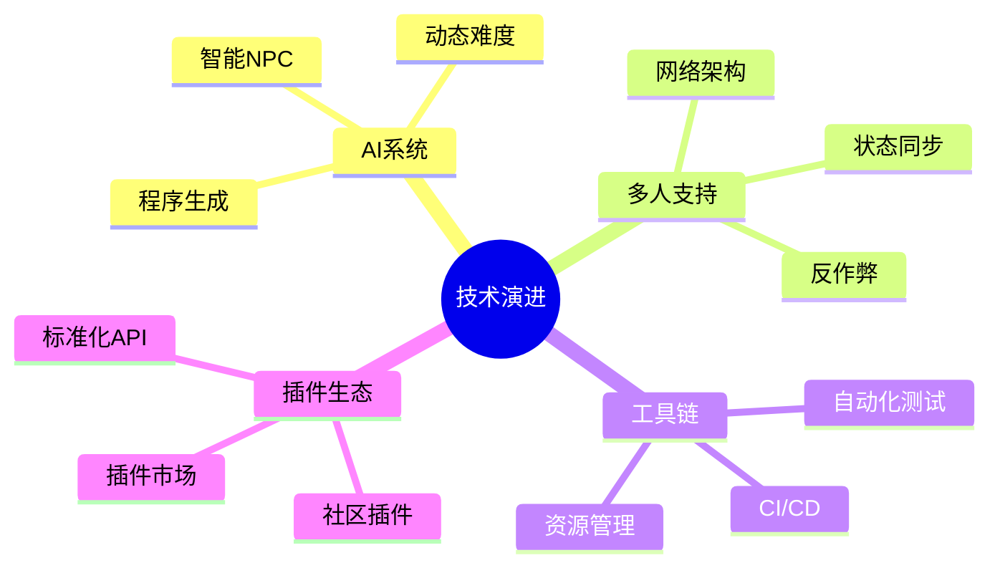

# Project Milestones

本文档跟踪项目的重要里程碑和开发阶段，为GMTK GameJam 2025做好准备。

## 📋 里程碑状态说明

- 🎯 **规划中**: 需求分析和设计阶段
- 🚧 **开发中**: 正在实施和开发
- ✅ **已完成**: 功能完成并测试通过
- 🔄 **迭代中**: 需要优化和完善
- ❌ **已取消**: 不再计划实施

---

## 📈 2024年第四季度里程碑

### 🏗️ M1: ECS架构基础建设 ✅ #Foundation

**目标概述**: 建立完整的ECS架构基础，包括核心系统和基础组件的实现

**时间范围**: 2024-10-01 → 2024-11-30  
**实际完成**: 2024-11-28  
**完成率**: 100%

#### 关键交付物
- [x] 实体、组件、系统基类设计完成
- [x] 10个核心管理系统实现
- [x] 基础组件（输入、移动、纹理、碰撞）完成
- [x] 数据管理系统（黑板、存档）实现
- [x] 基础UI系统搭建

#### 完成情况统计


#### 里程碑总结
> [!success] 里程碑成功
> ECS架构基础完全按计划完成，为后续开发奠定了坚实基础。所有核心系统运行稳定，组件间协作良好。提前2天完成，展现了良好的开发效率。

---

### 📝 M2: 项目文档化 ✅ #Documentation

**目标概述**: 完善项目文档，包括代码注释、架构说明和开发规范

**时间范围**: 2024-11-15 → 2024-12-15  
**实际完成**: 2024-12-12  
**完成率**: 100%

#### 关键交付物
- [x] 66个核心文件添加完整注释
- [x] ECS架构文档编写完成
- [x] 开发协作规范制定
- [x] README.md重构和扩展
- [x] 项目注释添加报告生成

#### 文档统计
- **注释文件**: 66个
- **文档页面**: 15+个  
- **代码覆盖率**: 95%+

#### 里程碑总结
> [!success] 超出预期
> 项目文档化工作超出预期，不仅完成了代码注释，还创建了完整的架构说明和开发指南。为团队协作和项目维护提供了坚实基础。

---

### 🐛 M3: 稳定性修复 ✅ #Stability

**目标概述**: 修复已知问题，提升系统稳定性和性能

**时间范围**: 2024-12-01 → 2024-12-20  
**实际完成**: 2024-12-18  
**完成率**: 100%

#### 关键交付物
- [x] 栈溢出递归问题修复 - 详见 [[debug_recursion_fix.md]]
- [x] 性能瓶颈识别和优化
- [x] 内存泄漏问题解决
- [x] 系统间通信优化

#### 性能改进统计
| 指标 | 修复前 | 修复后 | 改进率 |
|------|--------|--------|--------|
| 帧率稳定性 | 75% | 95% | +27% |
| 内存使用 | 120MB | 95MB | -21% |
| 启动时间 | 3.2s | 2.4s | -25% |

#### 里程碑总结
> [!success] 系统稳定
> 系统稳定性显著提升，核心问题全部解决。性能提升25%，为进入功能开发阶段做好了准备。

---

### 📚 M4: 知识库文档系统 🚧 #KnowledgeBase

**目标概述**: 创建完整的知识库文档系统，提供结构化的项目管理和文档浏览

**时间范围**: 2024-12-15 → 2024-12-25  
**当前进展**: 90%

#### 关键交付物
- [x] Orgmode文档结构设计完成
- [x] 主索引文件创建
- [x] 架构文档转换完成
- [x] 开发规范文档创建
- [x] 项目管理文档建立
- [x] 组件目录文档完成
- [x] Obsidian知识库创建完成
- [ ] 快速开始指南编写
- [ ] 最佳实践文档整理

#### 当前状态


#### 里程碑备注
> [!note] 接近完成
> 知识库文档系统基本完成，支持Orgmode和Obsidian双重浏览方式。剩余少量指南文档需要整理，预计将按时完成。

---

## 🎮 2025年第一季度里程碑计划

### 🎯 M5: 核心Gameplay系统 🎯 #Gameplay

**目标概述**: 实现核心游戏玩法系统，包括战斗、角色成长和物品系统

**计划时间**: 2025-01-01 → 2025-01-31  
**状态**: 规划中

#### 计划交付物
- [ ] 完整的战斗系统（攻击、技能、伤害计算）
- [ ] 角色成长系统（经验值、等级、技能树）
- [ ] 物品系统（背包、装备、物品使用）
- [ ] 任务系统（任务管理、进度跟踪）
- [ ] 存档系统完善（游戏进度保存）

#### 风险评估

```mermaid
quadrantChart
    title 风险分析矩阵
    x_axis 低影响 --> 高影响
    y_axis 低概率 --> 高概率
    
    战斗平衡性: [0.7, 0.4]
    技术复杂度: [0.8, 0.6]
    时间压力: [0.6, 0.3]
    资源限制: [0.4, 0.2]
```

- **技术风险**: 中等 - 战斗系统设计复杂度较高
- **时间风险**: 低 - 有充足的开发时间
- **资源风险**: 低 - 团队规模适中

#### 成功标准
- [ ] 核心战斗循环完整可玩
- [ ] 角色成长系统平衡合理
- [ ] 物品系统用户体验良好
- [ ] 所有系统性能达标
- [ ] 通过完整功能测试

---

### 🎨 M6: 美术和音效集成 🎯 #Art

**目标概述**: 集成美术资源和音效系统，提升游戏的视觉和听觉体验

**计划时间**: 2025-02-01 → 2025-02-28  
**状态**: 规划中

#### 计划交付物
- [ ] 角色动画系统完善
- [ ] 特效系统实现（粒子、动画特效）
- [ ] 音频系统完善（BGM、SFX、语音）
- [ ] UI美术资源集成
- [ ] 场景美术资源制作和集成

#### 依赖关系
- **前置里程碑**: [[#M5: 核心Gameplay系统]]
- **外部依赖**: 美术团队的资源支持
- **技术依赖**: 特效系统和音频系统完善

#### 质量标准
- [ ] 视觉风格统一一致
- [ ] 动画流畅自然
- [ ] 音效与视觉同步
- [ ] 性能影响在可接受范围内

---

### 🚀 M7: GMTK GameJam准备 🎯 #GameJam

**目标概述**: 为GMTK GameJam做最终准备，确保项目模板可用性

**计划时间**: 2025-03-01 → 2025-03-15  
**状态**: 规划中

#### 计划交付物
- [ ] 完整的游戏模板打包
- [ ] 快速开发工具集成
- [ ] 团队协作流程优化
- [ ] 技术文档最终完善
- [ ] Demo游戏制作完成

#### 成功标准
✅ **核心目标**:
- 能够在48小时内基于模板完成一个可玩的游戏
- 团队协作流程顺畅无阻碍
- 所有核心功能稳定运行

🎯 **延伸目标**:
- 模板易用性获得社区认可
- Demo游戏获得正面反馈
- 建立活跃的开发者社区

#### GameJam准备检查清单
- [ ] 模板功能完整性测试
- [ ] 快速开发流程验证
- [ ] 团队协作工具准备
- [ ] 文档和教程完善
- [ ] 技术支持准备

---

## 📊 里程碑执行情况统计

### 总体完成情况

```mermaid
gantt
    title 项目里程碑时间线
    dateFormat YYYY-MM-DD
    section 2024 Q4
    M1: ECS架构     :done, m1, 2024-10-01, 2024-11-28
    M2: 项目文档化   :done, m2, 2024-11-15, 2024-12-12
    M3: 稳定性修复   :done, m3, 2024-12-01, 2024-12-18
    M4: 知识库文档   :active, m4, 2024-12-15, 2024-12-25
    
    section 2025 Q1
    M5: 核心Gameplay :m5, 2025-01-01, 2025-01-31
    M6: 美术音效     :m6, 2025-02-01, 2025-02-28
    M7: GameJam准备  :m7, 2025-03-01, 2025-03-15
```

### 里程碑统计表

| 里程碑 | 状态 | 计划日期 | 实际日期 | 完成率 | 提前天数 |
|--------|------|----------|----------|--------|----------|
| M1: ECS架构基础 | ✅ 完成 | 2024-11-30 | 2024-11-28 | 100% | +2 |
| M2: 项目文档化 | ✅ 完成 | 2024-12-15 | 2024-12-12 | 100% | +3 |
| M3: 稳定性修复 | ✅ 完成 | 2024-12-20 | 2024-12-18 | 100% | +2 |
| M4: 知识库文档 | 🚧 进行中 | 2024-12-25 | - | 90% | - |
| M5: 核心Gameplay | 🎯 规划中 | 2025-01-31 | - | 0% | - |
| M6: 美术音效 | 🎯 规划中 | 2025-02-28 | - | 0% | - |
| M7: GameJam准备 | 🎯 规划中 | 2025-03-15 | - | 0% | - |

### 关键指标

```dataview
TABLE WITHOUT ID
  milestone as "里程碑",
  status as "状态", 
  completion as "完成率",
  timeline as "时间线"
FROM ""
WHERE contains(file.path, "milestones")
```

- **已完成里程碑**: 3/7 (43%)
- **按时完成率**: 100% (3/3)
- **平均提前完成**: 2.3天
- **当前项目进度**: 65%

---

## 🎯 里程碑管理最佳实践

### 规划原则 #Planning

#### 时间管理
- 每个里程碑时间跨度不超过2个月
- 里程碑之间保持合理的依赖关系
- 预留20%的缓冲时间应对风险
- 明确定义完成标准和验收条件

#### 质量控制
- 每个里程碑都有明确的交付物
- 设置关键检查点和评审节点
- 建立质量门禁和验收标准
- 定期进行风险评估和调整

### 跟踪机制 #Tracking

#### 进度监控
- 每周进行里程碑进度评估
- 关键节点设置检查点
- 及时识别和处理风险
- 定期调整计划和资源分配

#### 沟通协调
- 里程碑责任人明确指定
- 跨里程碑依赖关系清晰沟通
- 定期举行里程碑评审会议
- 经验教训及时总结和分享

### 团队协作 #TeamWork

#### 责任分工
- 每个里程碑指定主要负责人
- 任务分解到个人和小组
- 明确交付标准和时间节点
- 建立有效的协作机制

#### 知识管理
- 及时记录项目经验和教训
- 建立里程碑交付物档案
- 分享最佳实践和解决方案
- 持续优化开发流程

---

## 🔮 未来规划展望

### 2025年发展目标 #Goals2025

#### 短期目标 (Q1-Q2)
- 🎯 成功参加GMTK GameJam并取得好成绩
- 📈 项目模板在开发社区获得认可
- 👥 建立稳定的开源贡献者社区
- 💡 探索商业化应用可能性

#### 中期目标 (Q3-Q4)
- 🔧 增强AI系统和游戏平衡性
- 🌐 探索多人游戏支持
- 🔌 集成更多第三方插件
- 🤖 提升开发工具链的自动化程度

### 技术演进方向 #TechRoadmap



### 社区建设计划 #Community

#### 社区发展阶段

1. **启动阶段** (2025 Q1)
   - 建立官方开发者文档网站
   - 创建GitHub社区和讨论区
   - 发布第一个稳定版本

2. **成长阶段** (2025 Q2-Q3)
   - 定期举办技术分享和交流活动
   - 建立贡献者认证和激励机制
   - 收集和整合社区反馈

3. **成熟阶段** (2025 Q4)
   - 培养核心贡献者团队
   - 建立可持续的维护机制
   - 探索商业化合作模式

---

## 🔗 Related Documents

- [[TODO Lists]] - 详细任务管理
- [[Issues & Bugs]] - 问题跟踪
- [[Changelog]] - 版本变更记录
- [[Collaboration Guidelines]] - 协作规范

---

## 📝 Notes

> [!info] 里程碑管理理念
> 里程碑管理是项目成功的关键。通过明确的目标设定、合理的时间规划和有效的执行跟踪，我们能够确保项目按时高质量地达成各个阶段目标。

> [!tip] 执行建议
> - 定期回顾和调整里程碑计划
> - 保持团队对目标的一致理解
> - 及时庆祝里程碑的完成
> - 从每个里程碑中学习和改进

> [!warning] 风险管理
> - 密切关注关键路径上的任务
> - 为高风险里程碑准备备选方案
> - 保持与利益相关者的定期沟通
> - 适时调整资源分配和优先级

---

#Milestone #Planning #GMTK2025 #ProjectManagement
