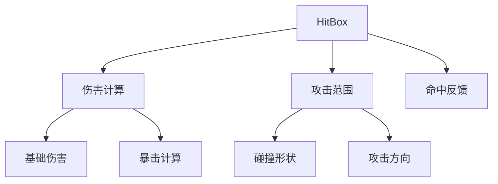
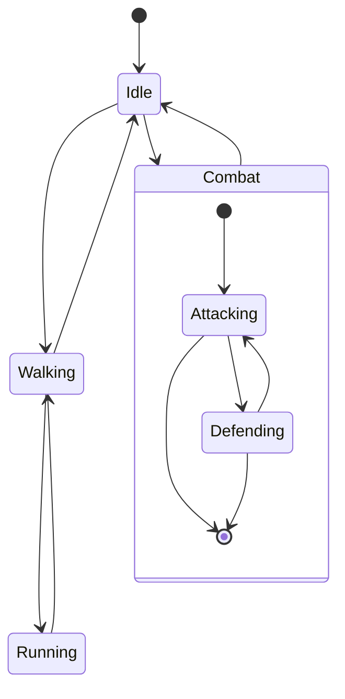
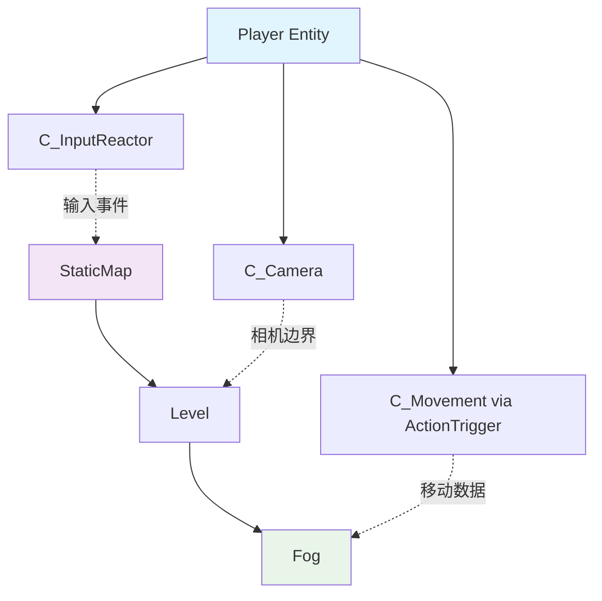
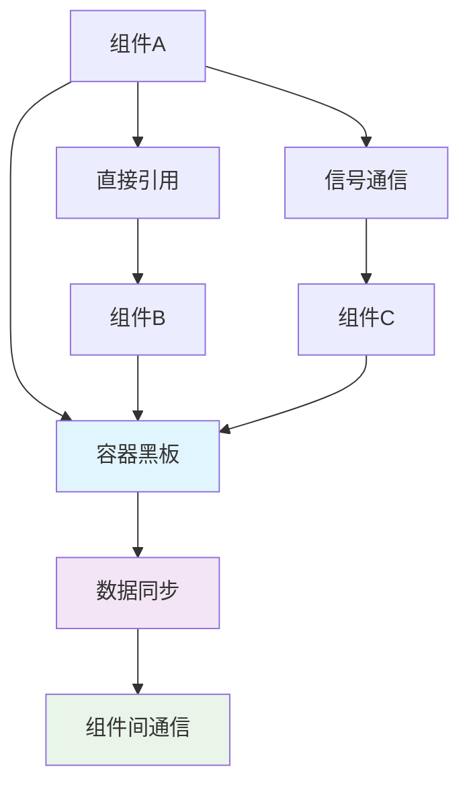
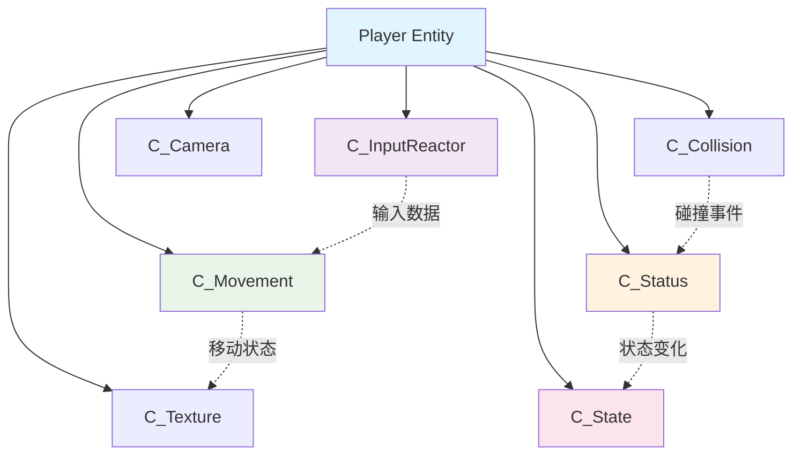
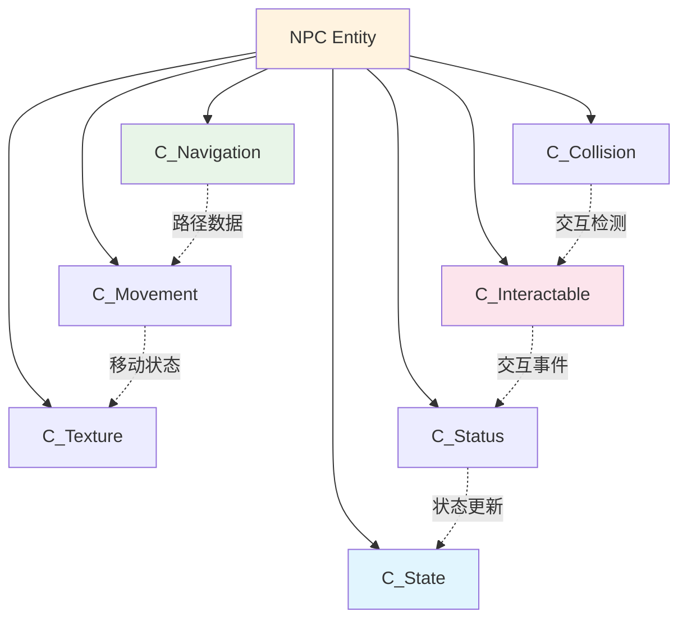

# Component Catalog

本文档提供了项目中所有组件的详细目录和API参考，包含66个核心文件中的所有组件实现。每个组件都包含详细的功能说明、配置参数、使用示例和API接口。

## 📖 文档说明

- 📁 **文件路径**: 组件在项目中的位置
- ⚙️ **配置参数**: 可导出的配置选项
- 🔗 **依赖关系**: 组件间的依赖和协作
- 📝 **使用示例**: 典型使用场景的代码示例
- 🔧 **API接口**: 公开方法和属性说明

## 🧭 组件分类索引

```dataview
TABLE WITHOUT ID
  choice(contains(string(tags), "Input"), "🎮", 
         contains(string(tags), "Visual"), "🎨",
         contains(string(tags), "Collision"), "💥",
         contains(string(tags), "State"), "📊", 
         "⚡") as "",
  file.name as "组件名称",
  tags as "标签"
FROM ""
WHERE contains(file.path, "Component")
SORT file.name ASC
```

- [[#🎮 控制相关组件|🎮 控制相关组件]] - 输入、移动、导航组件
- [[#🎨 视觉相关组件|🎨 视觉相关组件]] - 纹理、相机、气泡组件
- [[#💥 碰撞检测组件|💥 碰撞检测组件]] - 各种碰撞和交互检测
- [[#🤝 交互相关组件|🤝 交互相关组件]] - 对话、传送、拾取等交互
- [[#📊 状态管理组件|📊 状态管理组件]] - 状态机、数值、Buff系统
- [[#⚡ 行为控制组件|⚡ 行为控制组件]] - 行为队列、标记系统

---

## 🎮 控制相关组件 #Control

### C_InputReactor - 输入响应组件 #Input

#### 基本信息

- **文件路径**: `component/c_input_reactor/c_input_reactor.gd`
- **继承关系**: `IComponent → C_InputReactor`
- **功能描述**: 处理用户输入，支持多种移动模式和交互对象管理

#### ⚙️ 配置参数

```gdscript
## 移动模式配置
@export var movement_type: SoraConstant.MovementType = SoraConstant.MovementType.FOUR_DIRECTION

## 输入响应扩展列表
@export var reactor_extensions: Array[ReactorExtension] = []

## 当前交互对象列表（运行时维护）
var current_interactables: Array[Node] = []

## 输入向量（运行时计算）
var input_vector: Vector2 = Vector2.ZERO
```

#### 移动模式详解

| 模式 | 数值 | 输入方向 | 适用场景 |
|------|------|----------|----------|
| HORIZONTAL | 0 | 左右 | 横版游戏角色 |
| FOUR_DIRECTION | 1 | 上下左右 | 经典RPG角色 |
| EIGHT_DIRECTION | 2 | 八方向 | 策略游戏单位 |
| ALL_DIRECTION | 3 | 360度 | 飞行器、自由移动 |

#### 🔗 依赖关系
- **依赖组件**: 通常与[[C_Movement]]组件配合使用
- **输入源**: 依赖Godot的Input单例获取输入数据
- **扩展系统**: 支持ReactorExtension扩展

#### 🔧 API接口

```gdscript
## 添加交互对象到列表
func add_interactable(interactable: Node) -> void

## 从列表移除交互对象  
func remove_interactable(interactable: Node) -> void

## 获取当前最优交互对象
func get_current_best_interactable() -> Node

## 处理交互输入
func handle_interact_input() -> void

## 获取标准化输入向量
func get_movement_input() -> Vector2
```

#### 扩展系统

##### UIPanelOpenExtension #Extension
- **文件路径**: `reactor_extension/ui_panel_open_extension.gd`
- **功能**: 响应输入打开UI面板
- **配置**: `@export var target_ui_name: String`

##### MouseFocusExtension #Extension
- **文件路径**: `reactor_extension/mouse_focus_extension.gd`
- **功能**: 使节点跟随鼠标焦点移动
- **配置**: `@export var follow_speed: float = 5.0`

##### RayInteractConfirmExtension #Extension
- **文件路径**: `reactor_extension/ray_interact_confirm_extension.gd`
- **功能**: 基于射线检测的交互确认
- **配置**: `@export var interaction_ray: RayCast2D`

#### 📝 使用示例

```gdscript
## 场景中添加输入响应组件
var input_reactor = preload("res://component/c_input_reactor/c_input_reactor.tscn").instantiate()
input_reactor.movement_type = SoraConstant.MovementType.EIGHT_DIRECTION

## 添加UI面板开启扩展
var ui_extension = UIPanelOpenExtension.new()
ui_extension.target_ui_name = "inventory_ui"
input_reactor.reactor_extensions.append(ui_extension)

add_child(input_reactor)
```

---

### C_NavigationAgent - 导航代理组件 #Navigation

#### 基本信息

- **文件路径**: `component/c_navigation_agent/c_navigation_agent.gd`
- **继承关系**: `IComponent → C_NavigationAgent`
- **功能描述**: 为实体提供AI寻路和导航能力，基于Godot的NavigationAgent2D系统

#### ⚙️ 配置参数

```gdscript
## 导航类型枚举
enum NavType { 
    STOP,      ## 停止导航
    PAUSE,     ## 暂停导航
    TRACK,     ## 跟踪导航
    LOCATED    ## 定点导航
}

## 当前导航状态
var current_nav = NavType.STOP

## 导航目标位置
var target_position: Vector2

## 导航目标实体
var target_entity: IEntity

## 主要导航代理
@export var nav_agent: NavigationAgent2D

## 额外导航代理资源
@export var nav_agent_resource: Array[NavigationAgent2D]
```

#### 🔧 API接口

```gdscript
## 设置导航目标
func set_navigation_target(target: Vector2) -> void

## 开始导航
func start_navigation() -> void

## 停止导航
func stop_navigation() -> void

## 获取下一个路径点
func get_next_path_position() -> Vector2

## 检查是否到达目标
func is_navigation_finished() -> bool

## 获取到目标的距离
func get_distance_to_target() -> float
```

#### 📝 使用示例

```gdscript
## AI角色导航设置
var navigation = C_NavigationAgent.new()
navigation.current_nav = C_NavigationAgent.NavType.TRACK
navigation.target_entity = player
navigation.set_navigation_target(player.global_position)

## 定点导航示例
navigation.current_nav = C_NavigationAgent.NavType.LOCATED
navigation.target_position = Vector2(100, 200)
```

---

## 🎨 视觉相关组件 #Visual

### C_TextureController - 纹理控制器组件 #Texture

#### 基本信息

- **文件路径**: `component/c_texture_controller/c_texture_controller.gd`
- **继承关系**: `IComponent → C_TextureController`
- **功能描述**: 纹理和动画管理系统，支持多种精灵类型和动画控制

#### ⚙️ 配置参数

```gdscript
## 纹理类型
@export var texture_type: TextureType = TextureType.ANIMATED_SPRITE

## 精灵节点引用
@export var sprite_node: Node2D

## 动画播放器引用
@export var animation_player: AnimationPlayer

## 当前动画名称
@export var current_animation: String = "idle"

## 是否自动播放
@export var auto_play: bool = true

## 播放速度倍率
@export var speed_scale: float = 1.0
```

#### 纹理类型

| 类型 | 节点类型 | 适用场景 |
|------|----------|----------|
| SPRITE | Sprite2D | 静态纹理显示 |
| ANIMATED_SPRITE | AnimatedSprite2D | 简单动画序列 |
| ANIMATION_PLAYER | Sprite2D + AnimationPlayer | 复杂动画控制 |

#### 🔧 API接口

```gdscript
## 播放动画
func play_animation(animation_name: String, force_restart: bool = false) -> void

## 停止动画
func stop_animation() -> void

## 暂停动画
func pause_animation() -> void

## 设置动画速度
func set_animation_speed(speed: float) -> void

## 获取当前动画名称
func get_current_animation() -> String

## 检查动画是否正在播放
func is_animation_playing() -> bool

## 设置纹理
func set_texture(texture: Texture2D) -> void
```

#### 打包纹理系统

##### IPackedSprite - 打包精灵接口 #PackedSprite
- **文件路径**: `packed_texture/i_packed_sprite.gd`
- **功能**: 定义打包纹理的统一接口，提供高级纹理管理和动态动画切换
- **特性**: 多纹理管理、状态驱动纹理切换、复杂动画序列控制

```gdscript
## 打包精灵接口 - 提供高级纹理管理功能
class_name IPackedSprite extends Node2D

## 纹理部件字典 - 存储各部位的PackedPart节点
@export var sprite_part: Dictionary[StringName, PackedPart]
```

##### PackedPart - 打包纹理部件 #PackedPart
- **文件路径**: `packed_texture/packed_man/packed_part.gd`
- **功能**: 管理角色身体各部位的纹理组件
- **特性**: 编辑器实时预览、运行时动态纹理切换、自动Sprite2D管理

```gdscript
## 打包纹理部件类
class_name PackedPart extends Node2D

## 默认纹理资源 - 支持编辑器预览和运行时切换
@export var default_texture: Texture2D
var sprite: Sprite2D  # 内部管理的Sprite2D节点
```

##### PackedSpriteEditor - 精灵编辑器工具 #PackedSpriteEditor
- **文件路径**: `packed_texture/packed_man/packed_sprite_editor.gd`
- **功能**: 编辑器预览和调试工具，支持椭圆运动和深度管理
- **特性**: 角色朝向控制、椭圆运动轨迹、动态z_index深度

**核心参数:**
```gdscript
## 角色朝向角度 (范围: -1到1)
@export_range(-1,1) var rotation_angle: float = 0.0

## 椭圆参数 - 控制手臂运动轨迹
@export var ellipse_body_radius_x: float = 100.0
@export var ellipse_body_radius_y: float = 50.0

## 手部偏移量
@export var hand_offset: Vector2 = Vector2(0,-50)
```

**椭圆运动系统:**
- X坐标 = `ellipse_body_radius_x * cos(angle)`
- Y坐标 = `ellipse_body_radius_y * sin(angle)`
- 左手相对朝向逆时针偏移90度，右手顺时针偏移90度

**z_index深度管理:**
- 椭圆上半部分 (Y < 0): 手臂在身体**后面** (z_index-1)
- 椭圆下半部分 (Y ≥ 0): 手臂在身体**前面** (z_index+1)
- 基于椭圆几何位置实现自然的深度层次效果

##### PackedMan - 人物精灵实现 #PackedMan
- **文件路径**: `packed_texture/packed_man/packed_man.gd`
- **功能**: 具体的人物精灵动画控制实现
- **特性**: 节拍驱动动画系统、状态管理、与CActionTrigger集成

```gdscript
## 打包人物精灵实现类
extends IPackedSprite

var status_code: int = 0      # 状态控制变量
var rhythm: float = 5.0       # 动画节奏速度
var beat: float = 0.0         # 当前节拍位置
var peak_valley: float = 1.0  # 峰值谷值控制
```

#### 📝 使用示例

```gdscript
## 角色纹理组件设置
var texture_comp = C_TextureController.new()
texture_comp.texture_type = C_TextureController.TextureType.ANIMATED_SPRITE
texture_comp.current_animation = "walk"
texture_comp.speed_scale = 1.5

## 播放特定动画
texture_comp.play_animation("attack")

## 状态机集成示例（StateIdlePlayer）
@export var c_texture: CTextureController
func _enter():
    # 根据朝向设置待机动画
    var direction: Vector2 = vector_move.toward_direction
    c_texture.play_animation("idle_" + get_direction_string(direction))
```

---

### C_Camera - 相机组件 #Camera

#### 基本信息

- **文件路径**: `component/c_camera/c_camera.gd`
- **继承关系**: `IComponent → C_Camera`
- **设计模式**: Strategy Pattern（策略模式）
- **功能描述**: 相机控制系统，支持多种跟随策略

#### ⚙️ 配置参数

```gdscript
## 相机节点引用
@export var camera_node: Camera2D

## 跟随策略
@export var follow_strategy: CameraFollowStrategy

## 跟随目标
@export var follow_target: Node2D

## 平滑跟随系数
@export var smooth_factor: float = 5.0

## 相机边界限制
@export var camera_bounds: Rect2 = Rect2()

## 是否启用边界限制
@export var enable_bounds: bool = false
```

#### 🔗 跟随策略

##### CameraFollowMouseStrategy - 鼠标跟随策略 #Strategy
- **文件路径**: `follow_strategy/cfs_mouse_follow.gd`
- **特性**: 类似孤胆枪手的相机系统，结合玩家位置和鼠标位置
- **适用**: 动作游戏、射击游戏

```gdscript
## 鼠标跟随策略配置
@export var mouse_influence: float = 0.3
@export var max_mouse_distance: float = 200.0
@export var smooth_mouse_follow: bool = true
```

#### 🔧 API接口

```gdscript
## 设置跟随目标
func set_follow_target(target: Node2D) -> void

## 立即移动到目标位置
func snap_to_target() -> void

## 设置相机边界
func set_camera_bounds(bounds: Rect2) -> void

## 启用/禁用边界限制
func set_bounds_enabled(enabled: bool) -> void

## 获取相机当前位置
func get_camera_position() -> Vector2

## 开始相机震动
func start_camera_shake(duration: float, intensity: float) -> void

## 停止相机震动
func stop_camera_shake() -> void
```

#### 📝 使用示例

```gdscript
## 玩家相机设置
var camera_comp = C_Camera.new()
var mouse_strategy = CameraFollowMouseStrategy.new()
mouse_strategy.mouse_influence = 0.25
mouse_strategy.max_mouse_distance = 150.0
camera_comp.follow_strategy = mouse_strategy
camera_comp.follow_target = player
camera_comp.smooth_factor = 3.0

## 设置相机边界
camera_comp.set_camera_bounds(Rect2(-1000, -1000, 2000, 2000))
camera_comp.set_bounds_enabled(true)
```

---

### C_Balloon - 气泡组件 #Balloon

#### 基本信息

- **文件路径**: `component/c_balloon/c_balloon.gd`
- **继承关系**: `IComponent → C_Balloon`
- **功能描述**: UI气泡效果，支持动态显示和动画

#### ⚙️ 配置参数

```gdscript
## 气泡显示文本
@export var balloon_text: String = ""

## 气泡持续时间
@export var display_duration: float = 3.0

## 气泡偏移位置
@export var balloon_offset: Vector2 = Vector2(0, -50)

## 气泡动画类型
@export var animation_type: AnimationType = AnimationType.FADE_IN_OUT

## 是否自动隐藏
@export var auto_hide: bool = true

## 字体大小
@export var font_size: int = 14

## 背景颜色
@export var background_color: Color = Color.WHITE
```

#### 🔧 API接口

```gdscript
## 显示气泡
func show_balloon(text: String, duration: float = -1) -> void

## 隐藏气泡
func hide_balloon() -> void

## 设置气泡内容
func set_balloon_content(text: String, color: Color = Color.WHITE) -> void

## 检查气泡是否显示
func is_balloon_visible() -> bool

## 更新气泡位置
func update_balloon_position() -> void
```

#### 📝 使用示例

```gdscript
## NPC对话气泡
var balloon = C_Balloon.new()
balloon.balloon_offset = Vector2(0, -80)
balloon.animation_type = C_Balloon.AnimationType.SCALE_BOUNCE
balloon.show_balloon("你好，旅行者！", 4.0)

## 伤害数字气泡
var damage_balloon = C_Balloon.new()
damage_balloon.balloon_offset = Vector2(0, -30)
damage_balloon.background_color = Color.RED
damage_balloon.show_balloon("-150", 2.0)
```

---

## 💥 碰撞检测组件 #Collision

### C_CollisionBox - 碰撞盒组件

#### 基本信息

- **文件路径**: `component/c_collision_box/c_collision.gd`
- **继承关系**: `IComponent → C_CollisionBox`
- **功能描述**: 碰撞检测管理，支持多种碰撞盒类型和射线检测

#### ⚙️ 配置参数

```gdscript
## 碰撞盒字典 [名称 -> BoxCollision]
var collision_boxes: Dictionary = {}

## 射线检测字典 [名称 -> BoxRay]  
var collision_rays: Dictionary = {}

## 是否启用碰撞检测
@export var collision_enabled: bool = true

## 碰撞层级设置
@export var collision_layers: int = 1

## 碰撞掩码设置
@export var collision_mask: int = 1
```

#### 🔗 碰撞类型系统

##### HitBox - 攻击判定盒 #HitBox



- **文件路径**: `box_collision/hit_box/hit_box.gd`
- **继承**: `BoxCollision → HitBox`
- **功能**: 处理伤害输出和攻击检测

```gdscript
## 攻击判定配置
@export var damage_amount: float = 10.0
@export var attack_type: String = "physical"
@export var knockback_force: float = 100.0
@export var critical_chance: float = 0.1
@export var attack_effects: Array[String] = []
```

##### HurtBox - 受伤判定盒 #HurtBox
- **文件路径**: `box_collision/hurt_box/hurt_box.gd`
- **继承**: `BoxCollision → HurtBox`
- **功能**: 处理伤害接收和防御计算

```gdscript
## 受伤判定配置
@export var defense_value: float = 0.0
@export var damage_resistance: Dictionary = {} # 伤害类型 -> 抗性
@export var invulnerable_time: float = 0.5
@export var damage_multiplier: float = 1.0
```

##### InteractBox - 交互碰撞盒 #InteractBox
- **文件路径**: `box_collision/interaction_box/interaction_box.gd`
- **继承**: `BoxCollision → InteractBox`
- **功能**: 实体间交互检测

```gdscript
## 交互判定配置
@export var interaction_types: Array[String] = ["pickup", "npc"]
@export var require_input: bool = true
@export var interaction_cooldown: float = 1.0
@export var interaction_distance: float = 50.0
```

##### SightBox - 视觉检测盒 #SightBox
- **文件路径**: `box_collision/sight_box/sight_box.gd`
- **继承**: `BoxCollision → SightBox`
- **功能**: AI视觉感知系统

```gdscript
## 视觉检测配置
@export var sight_range: float = 200.0
@export var sight_angle: float = 90.0  # 度数
@export var sight_shape: SightShape = SightShape.CONE
@export var check_line_of_sight: bool = true
@export var sight_layers: int = 1
```

#### 射线检测系统

##### InteractRay - 交互射线 #Ray
- **文件路径**: `box_ray/interact_ray.gd`
- **继承**: `BoxRay → InteractRay`
- **功能**: 基于射线检测的精确交互系统

```gdscript
## 射线交互配置
@export var ray_length: float = 100.0
@export var ray_direction: Vector2 = Vector2.RIGHT
@export var interaction_groups: Array[String] = ["interactable"]
@export var continuous_detection: bool = false
```

#### 🔧 API接口

```gdscript
## 添加碰撞盒
func add_collision_box(name: String, box: BoxCollision) -> void

## 移除碰撞盒
func remove_collision_box(name: String) -> void

## 获取碰撞盒
func get_collision_box(name: String) -> BoxCollision

## 启用/禁用碰撞盒
func set_collision_box_enabled(name: String, enabled: bool) -> void

## 添加射线检测
func add_collision_ray(name: String, ray: BoxRay) -> void

## 获取射线检测结果
func get_ray_collision_result(name: String) -> Dictionary

## 检查是否与指定对象碰撞
func is_colliding_with(target: Node) -> bool
```

#### 📝 使用示例

```gdscript
## 玩家碰撞组件设置
var collision = C_CollisionBox.new()

# 添加受伤判定盒
var hurt_box = HurtBox.new()
hurt_box.defense_value = 5.0
hurt_box.invulnerable_time = 1.0
collision.add_collision_box("hurt", hurt_box)

# 添加交互判定盒
var interact_box = InteractBox.new()
interact_box.interaction_types = ["npc", "item"]
interact_box.require_input = true
collision.add_collision_box("interact", interact_box)

# 添加交互射线
var interact_ray = InteractRay.new()
interact_ray.ray_length = 64.0
interact_ray.interaction_groups = ["interactable"]
collision.add_collision_ray("interact_ray", interact_ray)
```

---

## 🤝 交互相关组件 #Interaction

### C_Interactable - 交互组件

#### 基本信息

- **文件路径**: `component/c_interactable/c_interactable.gd`
- **继承关系**: `IComponent → C_Interactable`
- **设计模式**: Strategy Pattern（策略模式）
- **功能描述**: 复杂交互系统，支持主动和被动交互

#### ⚙️ 配置参数

```gdscript
## 交互记录资源
@export var interaction_record: InteractionRecord

## 交互类型
@export var interaction_type: InteractionType = InteractionType.ACTIVE

## 被动交互实例
@export var passive_interaction: PassiveInteraction

## 交互冷却时间
@export var interaction_cooldown: float = 1.0

## 是否启用交互
@export var interaction_enabled: bool = true

## 交互优先级
@export var interaction_priority: int = 0
```

#### 🔗 交互模式

##### 主动交互 (ACTIVE) #Active
- 需要玩家按键确认
- 显示交互提示UI
- 支持交互条件检查

##### 被动交互 (PASSIVE) #Passive
- 自动触发交互
- 基于区域进入/离开
- 支持延迟和冷却

#### 交互行为类型

##### InteractionDialogue - 对话交互 #Dialogue
- **文件路径**: `interaction/dialogue_interaction/interaction_dialogue.gd`
- **继承**: `PassiveInteraction → InteractionDialogue`
- **功能**: 与NPC或其他实体的对话功能

```gdscript
## 对话交互配置
@export var dialogue_resource: DialogueResource
@export var dialogue_title: String = "dialogue_start"
@export var auto_start_dialogue: bool = false
@export var dialogue_balloon: PackedScene
```

##### InteractionTransport - 传送交互 #Transport
- **文件路径**: `interaction/transport_interaction/interaction_transport.gd`
- **继承**: `PassiveInteraction → InteractionTransport`
- **功能**: 实体在不同场景间的传送

```gdscript
## 传送交互配置
@export var target_map: String = ""
@export var target_position: Vector2 = Vector2.ZERO
@export var transport_transition: String = "fade"
@export var transport_delay: float = 0.5
@export var save_position: bool = true
```

##### InteractionCollect - 拾取交互 #Collect
- **文件路径**: `interaction/collect_interaction/interaction_collect.gd`
- **继承**: `PassiveInteraction → InteractionCollect`
- **功能**: 物品自动收集和拾取

```gdscript
## 拾取交互配置
@export var item_resource: ItemResource
@export var collect_amount: int = 1
@export var auto_collect: bool = true
@export var collect_effect: PackedScene
@export var collect_sound: AudioStream
```

#### 交互配置资源

##### InteractionRecord #Resource
- **文件路径**: `interaction/interaction_record.gd`
- **继承**: `Resource → InteractionRecord`
- **功能**: 交互配置资源，存储交互设置

```gdscript
## 交互记录配置
@export var interaction_name: String = ""
@export var interaction_description: String = ""
@export var interaction_icon: Texture2D
@export var required_items: Array[String] = []
@export var condition_script: GDScript
@export var cooldown_time: float = 0.0
```

#### 🔧 API接口

```gdscript
## 执行交互
func perform_interaction(interactor: Node) -> bool

## 检查交互条件
func can_interact(interactor: Node) -> bool

## 设置交互启用状态
func set_interaction_enabled(enabled: bool) -> void

## 获取交互描述文本
func get_interaction_description() -> String

## 开始交互冷却
func start_interaction_cooldown() -> void

## 检查是否在冷却中
func is_interaction_on_cooldown() -> bool
```

#### 📝 使用示例

```gdscript
## NPC对话交互设置
var npc_interactable = C_Interactable.new()
npc_interactable.interaction_type = C_Interactable.InteractionType.ACTIVE

var dialogue_interaction = InteractionDialogue.new()
dialogue_interaction.dialogue_resource = load("res://resource/plugins_resource/dialogue/npc_guard.dialogue")
dialogue_interaction.dialogue_title = "greet_player"
npc_interactable.passive_interaction = dialogue_interaction

## 传送门交互设置
var portal_interactable = C_Interactable.new()
portal_interactable.interaction_type = C_Interactable.InteractionType.PASSIVE

var transport_interaction = InteractionTransport.new()
transport_interaction.target_map = "level_2"
transport_interaction.target_position = Vector2(100, 100)
transport_interaction.transport_transition = "circle_wipe"
portal_interactable.passive_interaction = transport_interaction
```

---

## 📊 状态管理组件 #Status

### C_StatusList - 状态列表组件

#### 基本信息

- **文件路径**: `component/c_status_list/c_status_list.gd`
- **继承关系**: `IComponent → C_StatusList`
- **功能描述**: 状态管理，包含动态状态和静态数值管理

#### ⚙️ 配置参数

```gdscript
## 状态信息字典 [状态名 -> StatusInfo]
var status_infos: Dictionary = {}

## 数值信息字典 [数值名 -> NumInfo]
var num_infos: Dictionary = {}

## 状态扩展列表
@export var status_extensions: Array[StatusExtension] = []

## 状态变化事件
signal status_changed(status_name: String, old_value: float, new_value: float)
signal num_changed(num_name: String, old_value: float, new_value: float)
```

#### 🔗 状态类型

##### StatusInfo - 动态状态管理 #StatusInfo
- **用途**: 生命值、魔力值等动态变化的数值
- **特性**: 当前值、最大值、变化回调

```gdscript
## StatusInfo结构
class StatusInfo:
    var current_value: float
    var max_value: float
    var min_value: float = 0.0
    var regeneration_rate: float = 0.0
    var last_change_time: float = 0.0
```

##### NumInfo - 静态数值管理 #NumInfo
- **用途**: 攻击力、防御力等相对静态的数值
- **特性**: 基础值、修正值、计算缓存

```gdscript
## NumInfo结构
class NumInfo:
    var base_value: float
    var modifier_value: float = 0.0
    var multiplier: float = 1.0
    var cached_final_value: float
    var cache_dirty: bool = true
```

#### 状态扩展系统

##### StatusExtension - 状态扩展基类 #Extension
- **文件路径**: `status_extension/status_extension.gd`
- **功能**: 为状态组件提供复杂状态管理的扩展机制

```gdscript
## 状态扩展基类接口
func extension_init(status_component: C_Status) -> void
func extension_update(delta: float) -> void
func extension_reset() -> void
```

##### BuffListExtension - Buff系统扩展 #Buff
- **文件路径**: `status_extension/buff_list_extension.gd`
- **继承**: `StatusExtension → BuffListExtension`
- **功能**: 管理实体的临时效果和状态修改器

```gdscript
## Buff系统配置
@export var max_buff_count: int = 20
var active_buffs: Array[BuffData] = []
var buff_categories: Dictionary = {}

## Buff数据结构
class BuffData:
    var buff_id: String
    var buff_name: String
    var duration: float
    var remaining_time: float
    var stack_count: int = 1
    var max_stacks: int = 1
    var buff_effects: Array[BuffEffect] = []
```

##### InventoryExtension - 背包系统扩展 #Inventory
- **文件路径**: `status_extension/inventory_extension.gd`
- **继承**: `StatusExtension → InventoryExtension`
- **功能**: 提供物品存储和管理功能

```gdscript
## 背包系统配置
@export var inventory_size: int = 30
@export var item_categories: Array[String] = ["weapon", "armor", "consumable", "misc"]
var inventory_items: Array[ItemData] = []
var equipped_items: Dictionary = {} # 装备槽 -> ItemData

## 物品数据结构
class ItemData:
    var item_id: String
    var item_name: String
    var stack_count: int = 1
    var max_stack: int = 99
    var item_category: String = "misc"
    var item_properties: Dictionary = {}
```

#### 🔧 API接口

```gdscript
## 状态信息操作
func add_status_info(name: String, max_value: float, current_value: float = -1) -> void
func get_status_value(name: String) -> float
func set_status_value(name: String, value: float) -> void
func modify_status_value(name: String, delta: float) -> void
func get_status_percentage(name: String) -> float

## 数值信息操作
func add_num_info(name: String, base_value: float) -> void
func get_num_value(name: String) -> float
func modify_num_base_value(name: String, delta: float) -> void
func add_num_modifier(name: String, modifier: float) -> void
func set_num_multiplier(name: String, multiplier: float) -> void

## 扩展系统操作
func add_status_extension(extension: StatusExtension) -> void
func remove_status_extension(extension: StatusExtension) -> void
func get_status_extension(extension_type: String) -> StatusExtension
```

#### 📝 使用示例

```gdscript
## 玩家状态组件设置
var status = C_StatusList.new()

# 添加生命值和魔法值
status.add_status_info("health", 100.0, 100.0)
status.add_status_info("mana", 50.0, 50.0)

# 添加基础属性
status.add_num_info("attack", 15.0)
status.add_num_info("defense", 8.0)
status.add_num_info("speed", 100.0)

# 添加Buff系统扩展
var buff_extension = BuffListExtension.new()
status.add_status_extension(buff_extension)

# 添加背包系统扩展
var inventory_extension = InventoryExtension.new()
inventory_extension.inventory_size = 40
status.add_status_extension(inventory_extension)

# 使用示例
status.modify_status_value("health", -25.0)  # 受伤
status.add_num_modifier("attack", 5.0)       # 攻击力提升
```

---

### C_StateMachine - 状态机组件 #StateMachine

#### 基本信息

- **文件路径**: `component/c_state_machine/c_state_machine.gd`
- **继承关系**: `IComponent → C_StateMachine`
- **功能描述**: 层次化状态机，支持HFSM和PDA混合模式

#### ⚙️ 配置参数

```gdscript
## 状态机类型
@export var state_machine_type: StateMachineType = StateMachineType.HFSM

## 状态机实例
var state_machine: Node

## 初始状态名称
@export var initial_state: String = "idle"

## 状态配置字典
@export var state_configurations: Dictionary = {}

## 是否启用调试输出
@export var debug_mode: bool = false
```

#### 🔗 状态机类型

##### HFSM - 层次化有限状态机 #HFSM



- **文件路径**: `state_machine/state_machine_hfsm.gd`
- **功能**: 支持多层嵌套的复合状态机实现
- **特性**: 状态嵌套、并发状态、历史状态

```gdscript
## HFSM状态机配置
@export var max_nesting_level: int = 5
@export var support_parallel_states: bool = false
@export var enable_history_states: bool = true

var current_states: Array[State] = []  # 当前激活状态栈
var state_history: Dictionary = {}     # 状态历史记录
```

##### PDA - 下推自动机 #PDA
- **基类文件**: `state/state_pda.gd`
- **功能**: 状态栈管理，支持状态历史保存和恢复
- **特性**: 状态压栈、弹出、回滚操作

```gdscript
## PDA状态基类
class StatePda extends State:
    var state_stack: Array[String] = []
    var max_stack_size: int = 10
    
    func push_state(state_name: String) -> void
    func pop_state() -> String
    func peek_state() -> String
    func clear_stack() -> void
```

#### 混合状态实现

##### StateHfsm - 混合状态 #Mixed
- **文件路径**: `state/state_hfsm.gd`
- **继承**: `State → StateHfsm`
- **功能**: 混合层次化和下推自动机的复合状态

```gdscript
## 混合状态配置
@export var child_states: Dictionary = {}
@export var default_child: String = ""
@export var use_state_stack: bool = false
@export var stack_operations: Array[String] = []
```

#### 具体状态实现示例

##### 游戏状态 #GameState
- [[GamingStateNormal]] - 游戏正常进行状态，主要的游戏运行状态
- [[GamingStatePause]] - 游戏暂停状态，游戏逻辑暂停但UI保持响应

##### 玩家状态 #PlayerState
- [[StateIdlePlayer]] - 玩家空闲状态，处理玩家静止时的状态
- [[StateMovePlayer]] - 玩家移动状态，处理玩家移动时的状态和动画

#### 状态实现特色

##### StateIdlePlayer - 玩家空闲状态 #IdleState
- **文件路径**: `state/hfsm/state/player/state_idle_player.gd`
- **功能**: 玩家静止时的状态实现
- **特性**: 播放待机动画、监听移动输入、根据朝向调整角色方向

```gdscript
## 核心配置
@export var vector_move: IUpdateAction  # 移动策略组件
@export var c_texture: CTextureController  # 纹理组件

## 状态转换条件
# 检测到移动输入 → 切换到移动状态
# 触发交互 → 切换到交互状态
```

##### StateMovePlayer - 玩家移动状态 #MoveState
- **文件路径**: `state/hfsm/state/player/state_move_player.gd`
- **功能**: 玩家移动时的状态实现
- **特性**: 播放移动动画、处理移动输入、监听移动停止条件

```gdscript
## 核心配置
@export var vector_move: IUpdateAction  # 移动策略组件
@export var c_texture: CTextureController  # 纹理组件

## 状态转换条件
# 移动向量为零 → 切换到空闲状态
# 触发交互 → 切换到交互状态
```

#### 🔧 API接口

```gdscript
## 状态机控制
func start_state_machine() -> void
func stop_state_machine() -> void
func reset_state_machine() -> void

## 状态切换
func change_state(state_name: String, force: bool = false) -> bool
func push_state(state_name: String) -> bool  # PDA模式
func pop_state() -> bool                     # PDA模式

## 状态查询
func get_current_state_name() -> String
func get_active_states() -> Array[String]    # HFSM模式
func is_in_state(state_name: String) -> bool
func get_state_stack() -> Array[String]      # PDA模式

## 状态注册
func register_state(state_name: String, state_script: GDScript) -> void
func unregister_state(state_name: String) -> void

## 调试功能
func get_state_machine_info() -> Dictionary
func enable_debug_mode(enabled: bool) -> void
```

#### 📝 使用示例

```gdscript
## 玩家状态机设置
var state_comp = C_StateMachine.new()
state_comp.state_machine_type = C_StateMachine.StateMachineType.HFSM
state_comp.initial_state = "idle"
state_comp.debug_mode = true

# 注册玩家状态
state_comp.register_state("idle", StateIdlePlayer)
state_comp.register_state("walk", StateWalkPlayer)
state_comp.register_state("attack", StateAttackPlayer)

# 设置状态配置
state_comp.state_configurations = {
    "idle": {"can_interrupt": true, "auto_transitions": ["walk"]},
    "walk": {"movement_speed": 100.0, "can_interrupt": true},
    "attack": {"can_interrupt": false, "duration": 1.5}
}

state_comp.start_state_machine()

## AI状态机设置（PDA模式）
var ai_state = C_StateMachine.new()
ai_state.state_machine_type = C_StateMachine.StateMachineType.PDA
ai_state.initial_state = "patrol"

# AI行为状态切换示例
ai_state.change_state("chase")      # 切换到追逐状态
ai_state.push_state("attack")       # 压入攻击状态
ai_state.pop_state()                # 回到追逐状态
```

---

## ⚡ 行为控制组件 #Behavior

### C_ActionTrigger - 行动队列触发组件 #Action

#### 基本信息

- **文件路径**: `component/c_action_trigger/c_action_trigger.gd`
- **继承关系**: `IComponent → C_ActionTrigger`
- **功能描述**: 管理实体的定时行为和特殊动作，支持模组化的行为逻辑

#### ⚙️ 配置参数

```gdscript
## 当前动作列表
var current_action_list: Dictionary[NodePath, StringName] = {}

## 定时触发动作列表
@export var _action_list_time_record: Array[TimeRecord]

## 持续监听动作列表（内部使用）
var _action_list_update: Array[IUpdateAction]
```

#### 🔗 行为系统

##### IAction - 行为基类 #ActionBase
- **文件路径**: `action/i_action.gd`
- **继承**: `Node → IAction`
- **功能**: 定义可执行行为的抽象接口

```gdscript
## 行为基类接口
class IAction extends Node:
    @export var action_name: String = ""
    var c_action: CActionTrigger
    
    func _execute() -> void:
        # 子类实现具体行为
        pass
```

##### IUpdateAction - 更新行为基类 #UpdateAction
- **文件路径**: `action/update_action/i_update_action.gd`
- **继承**: `IAction → IUpdateAction`
- **功能**: 需要持续更新的行为基类

```gdscript
## 更新行为基类
class IUpdateAction extends IAction:
    var binding_entity: IEntity
    
    func _update(delta: float) -> void:
        # 持续更新逻辑
        pass
    
    func _reset() -> void:
        # 重置逻辑
        pass
```

##### TimeRecord - 时间记录 #TimeRecord
- **功能**: 定时行为的时间配置
- **特性**: 基于游戏时间的精确触发

```gdscript
## 时间记录配置
@export var target_hour: int
@export var target_minute: int
@export var target_event_keyword: String
```

#### 🔗 移动行为实现 #Movement

> **重要架构变化**: 移动功能不再是独立组件，而是通过行为动作实现

##### MoveVector - 向量移动行为 #MoveVector
- **文件路径**: `action/update_action/move_vector.gd`
- **继承**: `IUpdateAction → MoveVector`
- **功能**: 基于2D向量的实体移动实现，支持输入控制和AI控制，具备智能移动状态识别

```gdscript
## 向量移动配置
@export var c_input: CInputReactor = null      # 输入组件引用
@export var move_speed: float                  # 移动速度
@export var movement_threshold: float = 5.0    # 移动状态检测阈值
var move_vector: Vector2                       # 移动向量
var toward_direction: Vector2                  # 朝向方向
# 移动状态通过current_action_state管理: "idle" | "movement"
```

**控制模式**：
- **输入控制模式**: 从CInputReactor获取移动向量（玩家角色）
- **AI控制模式**: 通过代码直接设置移动向量（NPC和敌人）

**新增特性**：
- **智能状态识别**: 自动检测角色是否在移动
- **阈值控制**: 通过movement_threshold避免微小抖动误判
- **统一状态管理**: 使用current_action_state统一管理移动状态
- **实时状态更新**: 移动状态变化时自动更新行为状态
- **外部接口**: 提供get_movement_status()和get_current_speed()查询接口

##### MoveStrategyStraight - 直线移动行为 #MoveStraight
- **文件路径**: `action/update_action/move_straight.gd`
- **继承**: `IUpdateAction → MoveStrategyStraight`
- **功能**: 高速直线移动，专为子弹、投射物等临时对象设计，具备智能状态管理

```gdscript
## 直线移动配置
var direction: Vector2                         # 移动方向向量
var _time: float                              # 存活时间计数器
@export var movement_threshold: float = 50.0   # 移动状态检测阈值（高速阈值）
@export var max_lifetime: float = 2.0         # 生命周期最大时间
# 状态管理: "idle" | "movement" | "destroying"
```

**特性**：
- 高速直线移动（5000 * delta）
- 可配置生命周期（默认2秒）
- 与TempEntity生命周期集成
- **智能状态识别**: 自动检测移动、销毁状态
- **统一状态管理**: 使用current_action_state管理状态
- **生命周期感知**: 支持销毁前状态切换

**状态流转**：
1. **idle** → **movement**: 初始化后立即进入移动状态
2. **movement** → **destroying**: 达到生命周期结束时
3. **destroying**: 执行销毁逻辑

**外部接口**：
- `get_movement_status()`: 查询移动状态
- `get_current_speed()`: 获取当前速度
- `is_near_destruction()`: 检查是否即将销毁

#### 🔧 API接口

```gdscript
## 时间记录管理
func compare_time_record(current_time: int) -> void
func add_time_record(record: TimeRecord) -> void
func remove_time_record(record: TimeRecord) -> void

## 手动触发
func trigger_action(action_name: String) -> void

## 行为查询
func get_available_actions() -> Array[IAction]

## 私有方法
func _execute_timed_behavior(record: TimeRecord) -> void
```

#### 📝 使用示例

```gdscript
## 玩家移动行为设置
var action_trigger = C_ActionTrigger.new()

# 添加向量移动行为作为子节点
var move_vector = MoveVector.new()
move_vector.name = "MoveVector" 
move_vector.c_input = player_input_component  # 绑定输入组件
move_vector.move_speed = 200.0
action_trigger.add_child(move_vector)

## 子弹直线移动设置
var bullet_action = C_ActionTrigger.new()
var move_straight = MoveStrategyStraight.new()
move_straight.name = "MoveStraight"
move_straight.movement_threshold = 100.0  # 高速移动阈值
move_straight.max_lifetime = 3.0          # 3秒生命周期

# 通过黑板设置初始参数
bullet.blackboard.set_value("start_direction", Vector2.UP)
bullet.blackboard.set_value("max_lifetime", 3.0)
bullet_action.add_child(move_straight)

# 查询子弹状态示例
if move_straight.get_movement_status():
    print("子弹正在飞行，当前速度: ", move_straight.get_current_speed())
if move_straight.is_near_destruction():
    print("子弹即将销毁")

## 定时事件设置
var time_record = TimeRecord.new()
time_record.target_hour = 12
time_record.target_minute = 0
time_record.target_event_keyword = "noon_event"
action_trigger.add_time_record(time_record)

## 手动触发特定行为
action_trigger.trigger_action("special_skill")
```

#### 🔄 移动系统架构变化说明

**旧架构 (已移除)**:
```gdscript
# ❌ 旧的独立移动组件（已不存在）
var movement = C_Movement.new()
var strategy = MoveStrategyVector.new()
movement.move_strategy = strategy
```

**新架构 (当前)**:
```gdscript
# ✅ 新的行为动作模式
var action_trigger = C_ActionTrigger.new()
var move_behavior = MoveVector.new()
action_trigger.add_child(move_behavior)
```

**架构优势**:
- 🎯 **统一行为管理**: 移动、攻击、技能等都作为行为统一管理
- 🔧 **更高灵活性**: 可以动态添加、移除、组合不同行为
- 📊 **状态追踪**: 通过current_action_list统一追踪所有行为状态
- ⚡ **性能优化**: 集中的行为更新循环，减少组件间通信开销

---

### C_Marker - 标记组件 #Marker

#### 基本信息

- **文件路径**: `component/c_marker/c_marker.gd`
- **继承关系**: `IComponent → C_Marker`
- **功能描述**: 空间标记系统，用于导航和定位

#### ⚙️ 配置参数

```gdscript
## 标记类型
@export var marker_type: MarkerType = MarkerType.POINT

## 标记名称
@export var marker_name: String = ""

## 标记描述
@export var marker_description: String = ""

## 标记可见性
@export var visible_in_editor: bool = true
@export var visible_in_game: bool = false

## 标记颜色
@export var marker_color: Color = Color.WHITE

## 标记优先级
@export var marker_priority: int = 0
```

#### 🔗 标记类型

##### BoxMarker - 区域标记 #BoxMarker
- **文件路径**: `box_marker/box_marker.gd`
- **继承**: `C_Marker → BoxMarker`
- **功能**: 定义特定功能区域

```gdscript
## 区域标记配置
@export var marker_size: Vector2 = Vector2(64, 64)
@export var area_shape: AreaShape = AreaShape.RECTANGLE
@export var detection_layers: int = 1
@export var trigger_on_enter: bool = true
@export var trigger_on_exit: bool = false

signal area_entered(body: Node2D)
signal area_exited(body: Node2D)
```

#### 🔧 API接口

```gdscript
## 标记管理
func set_marker_visibility(visible: bool) -> void
func get_marker_position() -> Vector2
func set_marker_position(position: Vector2) -> void

## 区域检测（BoxMarker）
func is_position_in_area(position: Vector2) -> bool
func get_bodies_in_area() -> Array[Node2D]
func get_closest_body_in_area() -> Node2D

## 导航辅助
func get_distance_to(target_position: Vector2) -> float
func get_direction_to(target_position: Vector2) -> Vector2
```

#### 📝 使用示例

```gdscript
## 生成点标记
var spawn_marker = C_Marker.new()
spawn_marker.marker_type = C_Marker.MarkerType.POINT
spawn_marker.marker_name = "player_spawn"
spawn_marker.marker_description = "玩家出生点"
spawn_marker.marker_color = Color.GREEN

## 触发区域标记
var trigger_area = BoxMarker.new()
trigger_area.marker_name = "level_exit"
trigger_area.marker_size = Vector2(128, 64)
trigger_area.area_shape = BoxMarker.AreaShape.RECTANGLE
trigger_area.trigger_on_enter = true

# 连接区域进入信号
trigger_area.area_entered.connect(_on_level_exit_entered)
```

---

## 🗺️ 地图系统组件 #MapSystem

### 概述

虽然地图系统主要由系统级组件组成，但它们与ECS组件密切协作，提供世界管理、视野控制和空间导航功能。

### StaticMap - 静态地图系统 #StaticMap

#### 基本信息

- **文件路径**: `resource/node_template/map/static_map/static_map.gd`
- **继承关系**: `Node → StaticMap`
- **功能描述**: 游戏地图的核心管理组件，协调多层级地图加载和管理

#### ⚙️ 核心功能

```gdscript
## 地图核心配置
@export var player_spawn: PlayerSpawn        # 玩家出生点
@export_range(0, 1) var time: float         # 昼夜循环时间
@export var levels: Node2D                  # 层级集合
@export var map_filter: CanvasModulate      # 昼夜滤镜
@export var filter_gradient: GradientTexture1D  # 渐变纹理
```

#### 🔗 与组件的协作

- **C_Camera**: 提供相机边界信息
- **C_NavigationAgent**: 协调跨层级导航
- **C_ActionTrigger**: 处理地图事件触发
- **C_StatusList**: 存储地图相关的持久化数据

#### 📝 使用示例

```gdscript
## 地图初始化配置
var static_map = StaticMap.new()
static_map.time = 0.5  # 设置为正午
static_map.cutscene_enable = true

# 监听地图加载完成
SSignalBus.map_info_loaded.connect(_on_map_loaded)
SSignalBus.game_data_loaded_complete.connect(_on_all_loaded)
```

---

### Level - 层级管理系统 #Level

#### 基本信息

- **文件路径**: `resource/node_template/map/level.gd`
- **继承关系**: `Node2D → Level`
- **功能描述**: 单个地图层级的管理，提供楼层级碰撞导航控制

#### ⚙️ 层级组件

```gdscript
## 层级核心组件
@export var camera_limit: Control           # 相机限制区域
@export var room: Node2D                   # 房间碰撞体集合
@export var level_object_pool: Node2D      # 层级对象池
@export var level_fog: Fog                 # 层级迷雾
@export var level_id: int = 0              # 楼层ID标识
```

#### 🔧 碰撞导航管理

Level系统提供了完整的楼层级碰撞导航管理API：

```gdscript
## 碰撞导航控制API
func enable_all_collision_navigation() -> void    # 启用楼层碰撞导航
func disable_all_collision_navigation() -> void   # 禁用楼层碰撞导航
func is_collision_navigation_enabled() -> bool    # 查询启用状态
func get_collision_navigation_info() -> Dictionary # 获取状态信息
func get_camera_limit() -> Dictionary              # 获取相机边界
```

#### 🎯 组件集成优势

- **性能优化**: 只启用当前楼层的物理计算
- **状态管理**: 与C_StateMachine集成的楼层状态
- **对象池**: 与SObjectPool协作的临时实体管理
- **存档支持**: 完整的层级状态持久化

---

### Fog - 战争迷雾系统 #FogOfWar

#### 基本信息

- **文件路径**: `resource/node_template/map/static_map/fog.gd`
- **继承关系**: `TextureRect → Fog`
- **功能描述**: 类似RTS的战争迷雾效果，基于玩家位置的动态视野管理

#### ⚙️ 迷雾配置

```gdscript
## 迷雾系统配置
@export var camera_limit: Control          # 相机限制区域
@export var light_texture: Texture2D       # 光源纹理

## 运行时数据
var fog_image: Image                        # 迷雾图像数据
var fog_texture: ImageTexture              # 迷雾纹理对象
var light_image: Image                     # 光源图像数据
var player: CharacterBody2D               # 玩家引用
```

#### 🔗 与ECS组件协作

**与移动系统集成**：
```gdscript
## 智能更新机制
func _process(_delta: float) -> void:
    if !player.velocity.is_equal_approx(Vector2.ZERO):
        update_fog()
```

**与相机系统协作**：
- 基于camera_limit确定迷雾范围
- 与C_Camera组件的边界设置保持一致
- 支持动态相机边界调整

**性能优化特性**：
- **按需更新**: 只在玩家移动时更新迷雾
- **内存优化**: 图像数据复用和高效管理
- **着色器加速**: 使用GPU进行实时渲染

#### 📝 使用示例

```gdscript
## 迷雾系统配置示例
var fog = Fog.new()
fog.camera_limit = level.camera_limit
fog.light_texture = radial_gradient_texture

# 在Level中初始化
level.level_fog = fog
level._initialize_fog()  # 在地图加载完成后调用
```

---

### 地图着色器系统 #MapShaders

#### WarFog Shader - 迷雾着色器

**文件路径**: `resource/node_template/map/war_fog.gdshader`

```glsl
shader_type canvas_item;

uniform vec4 fog_color: source_color;
uniform sampler2D current_texture;

void fragment(){
    COLOR.rgb = fog_color.rgb;
    COLOR.a = (texture(TEXTURE, UV).r + texture(current_texture, UV).r) / 2.0;
}
```

**技术特性**：
- **双纹理混合**: 持久迷雾 + 当前光照
- **高性能**: 简化的fragment shader实现
- **实时更新**: 支持动态纹理参数

#### 与组件系统集成

```gdscript
## 着色器参数更新（Fog系统中）
material.set_shader_parameter("current_texture", current_texture)
material.set_shader_parameter("fog_color", Color.BLACK)
```

---

### 🎯 地图系统与ECS的设计模式

#### 1. 系统级组件模式

地图系统采用系统级组件设计，不继承IComponent，但提供类似的接口：

```gdscript
## 系统级组件特征
- 独立的生命周期管理
- 信号驱动的状态同步  
- 与ECS组件的松耦合集成
- 完整的存档支持
```

#### 2. 组合协作模式



#### 3. 数据流模式

- **上行数据流**: Entity组件 → 地图系统
- **下行数据流**: 地图系统 → Entity组件  
- **横向数据流**: 地图系统内部组件间协作

---

## 🔄 组件协作模式

### 🔗 数据共享机制



- **容器黑板**: 实体内组件间的数据共享
- **信号通信**: 基于Signal的事件驱动通信
- **直接引用**: 关键组件间的直接数据访问

### ⚙️ 生命周期管理

1. **组件初始化** (`component_init`): 组件加载时调用
2. **组件重置** (`component_reset`): 游戏重置时调用
3. **组件销毁**: 自动内存管理和资源清理

### 🎯 组件组合模式

#### 典型玩家实体组合



#### 典型NPC实体组合



---

## 📈 组件性能优化建议

### 组件启用/禁用 #Performance
- 不需要的组件及时禁用，减少不必要的计算
- 使用组件的 `set_process()` 和 `set_physics_process()` 控制更新

### 对象池化 #ObjectPool
- 频繁创建销毁的组件使用对象池
- 特别适用于子弹、特效、UI元素等

### 数据缓存 #Cache
- 状态组件中的计算结果进行缓存
- 避免每帧重复计算相同的数值

### 组件通信优化 #Communication
- 优先使用直接引用而非信号查找
- 减少不必要的信号连接和断开

---

## 🔗 Related Documents

- [[ECS Architecture Overview]] - ECS架构概述
- [[Component System Architecture]] - 组件系统架构详解
- [[System Architecture]] - 系统架构详解
- [[Entity System]] - 实体系统详解
- [[Coding Standards]] - 编码规范

---

## 📝 Notes

> [!info] 组件目录说明
> 组件目录是理解和使用ECS架构的重要参考文档。
> 每个组件都经过精心设计，遵循单一职责原则，提供清晰的API接口。

> [!tip] 使用建议
> - 合理组合这些组件，可以实现复杂而强大的游戏功能
> - 充分利用组件的扩展系统增加新特性
> - 注意组件间的依赖关系和通信方式
> - 定期检查组件性能表现

> [!example] 实践示例
> 查看每个组件的使用示例，了解典型的配置和使用方法。
> 这些示例都来自实际的项目应用，具有很好的参考价值。

---

#Component #Catalog #Reference #API #ECS
