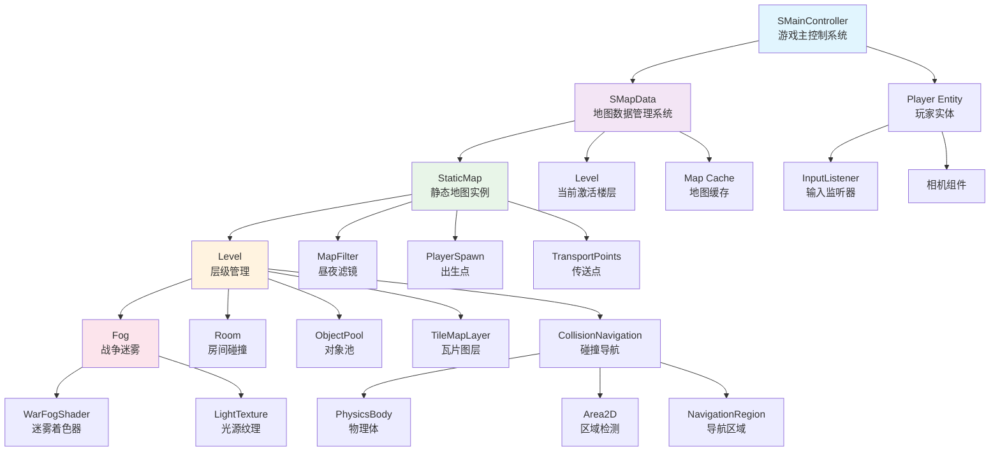
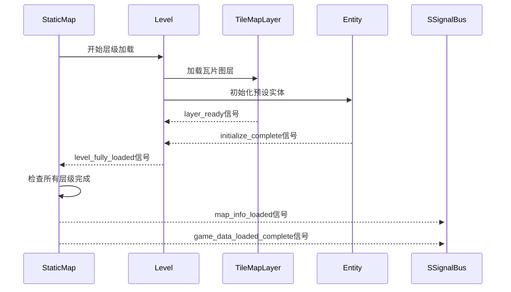
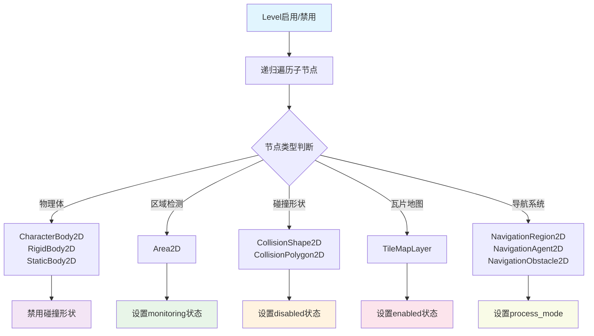
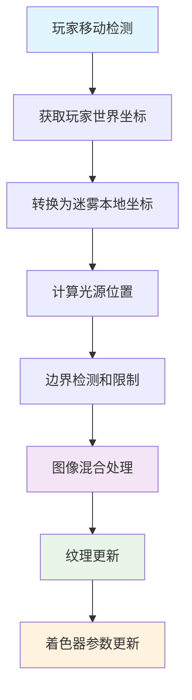
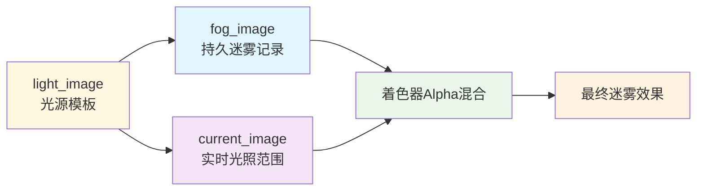
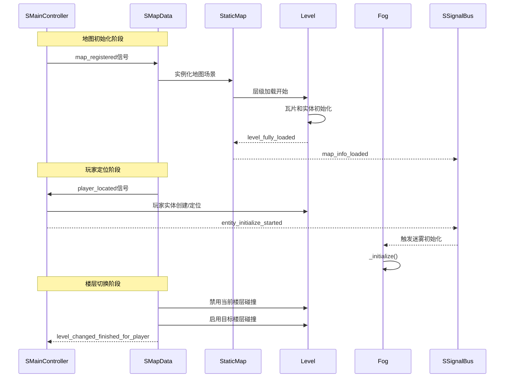

# ECS系统架构

本文档详细描述了项目中的ECS（Entity-Component-System）架构，包括实体管理、组件系统、全局系统、地图系统、交互系统和场景管理。

## 🎯 系统概述

本项目采用ECS（Entity-Component-System）架构设计，是一个高度模块化的游戏开发框架。ECS架构将游戏逻辑分离为实体、组件和系统三个核心部分，提供了优秀的可扩展性和维护性。

### ✨ ECS核心特性

- **实体管理**: 基于IEntity的统一实体接口，支持FixedEntity、TempEntity、Player等多种实体类型
- **组件系统**: 模块化组件设计，包括交互、标记、状态机、碰撞等功能组件
- **全局系统**: 信号总线、对象池、数据管理等核心系统服务
- **地图系统**: 多层级地图结构、战争迷雾、碰撞导航管理
- **交互系统**: 灵活的实体交互机制，支持对话、收集、传送、伙伴招募等
- **场景管理**: 启动器、主进程、过场动画的统一管理

---

## 🏗️ 系统架构



---

## 🧩 实体系统 (Entity System)

### IEntity - 实体基类

- **文件路径**: `entity/i_entity.gd`
- **设计模式**: 基类模板、组件聚合
- **功能描述**: 所有游戏实体的基础接口，定义了实体的生命周期和组件管理

#### 核心功能

```gdscript
## 初始化完成信号 - 当实体初始化完成时发出
signal initialize_complete

## 主控制节点 - 管理实体的主要功能逻辑
@export var main_control: Node
## 组件容器 - 存储实体的所有组件
@export var component_container: Node
## 基础组件列表 - 实体必需的核心组件
@export var list_base_components: Array[IComponent]
```

### FixedEntity - 固定实体

- **文件路径**: `entity/entity_packed/fixed_entity/fixed_entity.gd`
- **功能描述**: 具有完整生命周期的游戏实体，支持保存/加载、组件管理和状态同步

```gdscript
## 射线交互信号 - 当实体被射线检测交互时发出
signal entity_ray_interact

## 初始化数据 - 实体的配置和状态数据
@export var init_data: Dictionary
## 是否为原始实体 - 标识是否为场景中预设的实体
@export var is_entity_origin_exist: bool = true
```

### TempEntity - 临时实体

- **文件路径**: `entity/entity_packed/temp_entity/temp_entity.gd`
- **功能描述**: 轻量级临时实体，专为对象池设计，支持快速生成和回收

```gdscript
## 销毁信号 - 当临时实体被回收时发出
signal despawned

## 对象池键值 - 标识实体所属的对象池
@export var pool_key: StringName
## 层级对象池引用 - 管理此实体的对象池实例
@export var level_object_pool: LevelObjectPool
```

### IPlayer - 玩家实体

- **文件路径**: `entity/entity_packed/fixed_entity/player/i_player.gd`
- **功能描述**: 玩家角色的特殊实体实现，继承FixedEntity并添加玩家特有的功能

---

## 🔧 组件系统 (Component System)

### IComponent - 组件基类

- **文件路径**: `component/i_component.gd`
- **设计模式**: 抽象基类、依赖注入
- **功能描述**: 所有组件的基础接口，定义组件的生命周期和与实体的绑定关系

### CInteractable - 交互组件

- **文件路径**: `component/c_interactable/c_interactable.gd`
- **功能描述**: 管理实体的交互行为和交互逻辑，支持主动交互和被动交互两种模式

```gdscript
## 交互资源列表 - 配置实体的各种交互行为
@export var interactions_resources: Array[InteractionRecord]
## 交互信息列表 - 运行时的交互状态管理
var interaction_infos: Array[InteractionRecordInfo] = []
```

#### 交互类型

- **BodyEntered**: 物体进入触发
- **AreaEntered**: 区域进入触发  
- **RayCasted**: 射线检测触发
- **Null**: 无碰撞检测

### CMarker - 标记组件

- **文件路径**: `component/c_marker/c_marker.gd`
- **功能描述**: 提供空间标记和定位功能，支持多种标记类型

```gdscript
## 标记类型枚举
enum MarkerType { Position, Dialogue, Transport, Item }

## 标记类型 - 定义标记的功能类型
@export var marker_type: MarkerType = MarkerType.Position
## 标记ID - 唯一标识符
@export var marker_id: StringName
## 描述信息 - 标记的详细说明
@export var description: String
```

---

## 🌐 全局系统 (Global Systems)

### SSignalBus - 全局信号总线

- **文件路径**: `system/s_signal_bus/s_signal_bus_global.gd`
- **功能描述**: 系统间事件通信的中央枢纽，提供统一的信号管理和分发机制

#### 核心信号

```gdscript
## 地图信息加载完成信号 - 游戏已经完成了地图数据信息的加载，下一步是初始化所有实体并刷新HUD状态
signal map_info_loaded

## 实体初始化开始信号 - 玩家角色成功放入地图，可以正式开始初始化所有的实体
signal entity_initialize_started

## 游戏数据加载完成信号 - 实体初始化完毕，已经可以正常开始游戏
signal game_data_loaded_compelete

## 游戏循环开始信号 - 标志着游戏主循环的正式启动
signal game_loop_start
```

### SObjectPool - 对象池系统

- **文件路径**: `system/s_object_pool/s_object_pool_global.gd`
- **功能描述**: 管理游戏中临时实体的生成、复用和销毁，通过预创建对象池来避免运行时的内存分配和垃圾回收开销

#### 核心功能

```gdscript
## 层级对象池清理信号 - 当特定关卡的对象池需要清理时发出的信号
signal level_pool_cleared(level: Level)

## 对象池字典 - 存储所有活跃的对象池实例，键为池标识符，值为对象池实例
var _pools: Dictionary[StringName, LevelObjectPool] = {}
```

#### 应用场景

- **子弹系统**: 频繁生成和销毁的子弹实体
- **特效系统**: 粒子特效、爆炸效果等临时视觉元素
- **音效系统**: 临时音频播放器实例
- **临时标记**: 短期存在的游戏对象

---

## 🎮 交互系统 (Interaction System)

### Interaction - 交互基类

- **文件路径**: `component/c_interactable/interaction/interaction.gd`
- **功能描述**: 所有交互逻辑的抽象基类，定义交互的生命周期和基本接口

### 具体交互类型

#### InteractionDialogue - 对话交互

- **功能描述**: 管理与NPC的对话功能，支持DialogueManager集成

#### InteractionCollect - 收集交互

- **功能描述**: 实现自动物品收集和拾取逻辑，支持物品类型验证

#### InteractionTransport - 传送交互

- **功能描述**: 处理实体在场景间的传送功能

#### InteractionBePartner - 伙伴招募交互

- **功能描述**: 处理招募目标角色作为玩家伙伴的逻辑

### InteractionRecord - 交互配置资源

- **文件路径**: `component/c_interactable/interaction_record.gd`
- **功能描述**: 存储交互配置数据的资源类，支持运行时交互行为定制

---

## 🎬 场景管理 (Scene Management)

### Launcher - 游戏启动器

- **文件路径**: `scene/launcher/launcher.gd`
- **功能描述**: 管理游戏启动模式和主进程初始化

```gdscript
## 游戏模式枚举
enum GameMode { MAIN_GAME, TEST_GAME }

## 启动模式 - 定义游戏的启动方式
@export var mode: GameMode = GameMode.MAIN_GAME
```

### Main - 主进程控制

- **文件路径**: `scene/launcher/main/main.gd`
- **功能描述**: 游戏的核心启动和协调中心，负责系统初始化和游戏循环控制

```gdscript
## 系统设置完成信号 - 当所有核心系统初始化完成时发出
signal system_setup_completed

## 物理层枚举 - 定义游戏中的物理碰撞层
enum PhysicsLayer { DEFAULT = 1, PLAYER = 2, ENEMY = 4, WORLD = 8 }
```

### LogoTransition - Logo过渡

- **文件路径**: `scene/logo_transition.gd`
- **功能描述**: 处理品牌展示和游戏启动时的过渡动画

### Cutscene - 过场动画系统

- **文件路径**: `scene/static_map/cutscene/cutscene.gd`
- **功能描述**: 定义过场动画逻辑的抽象基类接口

---

## 🗺️ StaticMap - 静态地图系统

### 基本信息

- **文件路径**: `resource/node_template/map/static_map/static_map.gd`
- **继承关系**: `Node → StaticMap`
- **设计模式**: 组合模式、观察者模式
- **功能描述**: 游戏地图的核心管理组件，负责多层级地图结构的组织和加载

### ⚙️ 核心配置

```gdscript
## 玩家出生点配置
@export var player_spawn: PlayerSpawn

## 昼夜循环时间（0.0-1.0）
@export_range(0, 1) var time: float

## 层级集合容器
@export var levels: Node2D

## 自动加载过场事件
@export var autoload_cutscene: Node

## 地图视觉滤镜
@export var map_filter: CanvasModulate
@export var filter_gradient: GradientTexture1D

## 过场剧情控制
@export var cutscene_enable: bool = true
```

### 🔄 加载机制

#### 异步分层加载



#### 📊 加载状态统计

```gdscript
## 加载统计数据
var level_count: int = 0              # 总层级数量
var level_loaded_count: int = 0       # 已加载层级数量
var level_initialized_count: int = 0  # 已初始化层级数量
```

### 🌅 昼夜循环系统

#### 时间滤镜机制

StaticMap支持基于时间的动态视觉效果：

```gdscript
## 时间变化处理（避免递归调用）
func time_change_filter(point: float):
    _update_filter(point)

## 直接更新滤镜颜色
func _update_filter(time_value: float):
    if map_filter and filter_gradient:
        map_filter.color = filter_gradient.gradient.sample(time_value)
```

**技术特点**：
- 基于梯度纹理的颜色插值
- 避免递归调用的优化设计
- 支持外部时间系统驱动
- 实时视觉效果更新

### 🚪 传送点管理

```gdscript
## 导出的传送点列表
var exported_transport_points: Dictionary[StringName, TransportPoint] = {}
```

- **全局访问**: 可被其他地图的传送点直接引用
- **自动收集**: Level加载完毕后自动刷新
- **跨地图传送**: 支持复杂的地图间导航

---

## 🏢 Level - 层级管理系统

### 基本信息

- **文件路径**: `resource/node_template/map/level.gd`
- **继承关系**: `Node2D → Level`
- **功能描述**: 静态地图中单个层级的管理，负责瓦片图层加载、实体初始化、碰撞导航管理

### 🎯 核心功能

#### 1. 瓦片图层管理

```gdscript
## 瓦片图层统计
var layers_count = 0        # 瓦片图层总数
var layers_loaded_count = 0 # 已加载瓦片图层数

## 支持的瓦片类型
- TileMapLayer: 标准瓦片图层
- PolygonTile: 多边形瓦片
```

#### 2. 实体管理系统

```gdscript
## 实体统计
var entity_count = 0        # 预设实体总数
var entity_loaded_count = 0 # 已初始化实体数

## 支持的实体类型
- FixedEntity: 固定实体
- TransportPoint: 传送点
```

#### 3. 组件协调

```gdscript
## 层级核心组件
@export var camera_limit: Control      # 相机限制区域
@export var room: Node2D               # 房间碰撞体集合
@export var level_object_pool: Node2D  # 层级对象池
@export var level_fog: Fog             # 层级迷雾
```

### 🧭 碰撞导航统一管理

#### 楼层级碰撞控制

Level系统提供了完整的楼层级碰撞导航管理，解决多层建筑中的碰撞干扰问题：

```gdscript
## 楼层标识
@export var level_id: int = 0

## 碰撞导航状态
var collision_navigation_enabled: bool = true
```

#### 智能碰撞管理



#### 核心API

```gdscript
## 楼层碰撞导航控制
func enable_all_collision_navigation()   # 启用楼层所有碰撞导航
func disable_all_collision_navigation()  # 禁用楼层所有碰撞导航
func is_collision_navigation_enabled() -> bool  # 检查状态

## 状态信息查询
func get_collision_navigation_info() -> Dictionary
func get_camera_limit() -> Dictionary
```

**设计优势**：
- 🎯 **性能优化**: 只启用当前楼层的碰撞检测
- 🚫 **干扰消除**: 避免跨楼层的物理干扰
- 🔄 **状态追踪**: 完整的启用/禁用状态管理
- 📊 **调试支持**: 详细的日志输出和状态查询

---

## 🌫️ Fog - 战争迷雾系统

### 基本信息

- **文件路径**: `resource/node_template/map/static_map/fog.gd`
- **继承关系**: `TextureRect → Fog`
- **功能描述**: 类似RTS游戏的战争迷雾效果，提供基于玩家位置的动态视野管理

### 🎨 技术实现

#### 实时图像处理

```gdscript
## 核心数据结构
var fog_image: Image         # 迷雾图像数据
var fog_texture: ImageTexture # 迷雾纹理对象
var light_image: Image       # 光源图像数据
var current_image: Image     # 当前图像
var current_texture: ImageTexture # 当前纹理对象
```

#### 动态视野算法



#### 核心算法

```gdscript
## 基于玩家位置更新迷雾
func update_fog():
    # 1. 坐标转换（含视觉偏移优化）
    var player_world_pos = player.global_position
    var fog_world_origin = camera_limit.global_position
    var player_local_pos = player_world_pos - fog_world_origin + Vector2(0, -20)
    
    # 2. 光源位置计算
    var light_size = light_image.get_size()
    var light_position = player_local_pos - Vector2(light_size.x / 2, light_size.y / 2)
    
    # 3. 边界限制
    var fog_size = fog_image.get_size()
    light_position.x = clamp(light_position.x, 0, fog_size.x - light_size.x)
    light_position.y = clamp(light_position.y, 0, fog_size.y - light_size.y)
    
    # 4. 双层图像混合
    fog_image.blend_rect(light_image, Rect2i(Vector2.ZERO, light_size), Vector2i(light_position))
    
    # 5. 着色器纹理更新
    fog_texture.update(fog_image)
    current_image.fill(Color.WHITE)
    current_image.blend_rect(light_image, Rect2i(Vector2.ZERO, light_size), Vector2i(light_position))
    current_texture.update(current_image)
```

### 🚀 性能优化

#### 智能更新触发

```gdscript
## 优化的移动检测
func _process(_delta: float) -> void:
    if !player.velocity.is_equal_approx(Vector2.ZERO):
        update_fog()
```

**优化特点**：
- ⚡ **按需更新**: 只在玩家移动时更新迷雾
- 🎯 **精确检测**: 使用velocity检测而非位置比较
- 💾 **内存高效**: 图像数据复用和优化管理
- 🔧 **一致性渲染**: current_image直接使用光源模板，确保视觉统一
- 📐 **视觉调优**: Y轴偏移优化，提升用户体验
- 🚀 **代码简化**: 去除不必要的类型转换，提高执行效率

### 🎮 使用配置

```gdscript
## 迷雾配置参数
@export var camera_limit: Control  # 相机限制区域
@export var light_texture: Texture2D  # 光源纹理
```

**典型配置**：
- **光源纹理**: 径向梯度纹理，中心透明，边缘不透明
- **迷雾范围**: 与相机限制区域一致
- **更新频率**: 基于玩家移动状态的动态调整

---

## 🎨 WarFog Shader - 迷雾着色器

### 基本信息

- **文件路径**: `resource/node_template/map/war_fog.gdshader`
- **着色器类型**: `canvas_item`
- **功能描述**: 支持战争迷雾效果的高性能着色器实现

### 📝 着色器实现

```glsl
shader_type canvas_item;

uniform vec4 fog_color: source_color;
uniform sampler2D current_texture;

void fragment(){
    COLOR.rgb = fog_color.rgb;
    COLOR.a = (texture(TEXTURE, UV).r + texture(current_texture, UV).r) / 2.0;
}
```

### 🔧 技术特性

#### 双纹理混合优化



**优化实现原理**：
- **fog_image**: 累积存储已探索区域的永久记录
- **current_image**: 实时渲染当前玩家光照范围（直接使用light_image混合）
- **light_image**: 光源模板，同时用于两个纹理的构建
- **着色器混合**: 平均两个纹理的alpha值，创造更自然的视觉过渡效果

**技术优势**：
- 🎯 **一致性渲染**: current_image直接使用光源模板，确保视觉一致性
- ⚡ **性能优化**: 减少中间计算步骤，提高渲染效率
- 🔧 **视觉偏移**: Y轴-20像素偏移，优化视觉体验

#### 参数配置

```gdscript
## 着色器参数
uniform vec4 fog_color: source_color = Color.BLACK  # 迷雾颜色
uniform sampler2D current_texture                   # 当前纹理
```

**优化使用示例**：
```gdscript
# 在Fog初始化中的简化调用
func _initialize():
    # ... 其他初始化代码 ...
    
    # 简化的着色器参数设置
    material.set_shader_parameter("current_texture", current_texture)
    
    # 完整配置示例
    var shader_material = ShaderMaterial.new()
    shader_material.shader = load("res://resource/node_template/map/war_fog.gdshader")
    shader_material.set_shader_parameter("fog_color", Color.BLACK)
    material = shader_material
```

---

## 🔧 系统集成

### 📡 信号通信



### 🔄 生命周期管理

#### 1. 系统初始化阶段

```gdscript
# SMainController系统
_setup() -> 
  连接伙伴管理信号 -> 
  连接玩家定位信号 ->
  配置输入监听器

# SMapData系统
_enter_tree() ->
  连接地图管理信号 ->
  连接楼层切换信号 ->
  连接实体添加信号

# StaticMap初始化
_enter_tree() -> 
  连接Layer信号 -> 
  配置过场剧情 -> 
  等待加载完成

# Level初始化  
_enter_tree() ->
  瓦片图层ready连接 ->
  实体initialize连接 ->
  检查加载状态

# Fog初始化
_enter_tree() ->
  禁用处理模式 ->
  等待_initialize()调用
```

#### 2. 运行阶段

```gdscript
# 系统级更新循环
SMapData.level_management -> 楼层碰撞控制和切换
SMainController.input_processing -> 玩家控制和移动处理

# 地图级更新循环
Fog._process() -> 检测玩家移动 -> update_fog()
StaticMap.time_change_filter() -> 更新昼夜滤镜
Level.collision_management -> 楼层碰撞控制
```

#### 3. 存档系统

```gdscript
# 系统级存档收集
SMapData._data_saving() ->
  收集地图缓存数据 ->
  记录当前地图和楼层 ->
  调用StaticMap._save()

# 地图级存档收集
StaticMap._save() ->
  遍历所有Level ->
  收集Level._save_as() ->
  合并到SavedDataFile
```

---

## 🎯 使用指南

### 📦 场景组织

```
StaticMap (Node)
├── Levels (Node2D)
│   ├── Level_0 (Node2D) [Level]
│   │   ├── CameraLimit (Control)
│   │   │   └── Fog (TextureRect) [Fog]
│   │   ├── Room (Node2D)
│   │   └── ObjectPool (Node2D)
│   └── Level_1 (Node2D) [Level]
├── AutoLoadCutscene (Node)
└── MapFilter (CanvasModulate)
```

### ⚙️ 配置步骤

#### 1. 系统级配置

```gdscript
# SMainController配置
SMainController.player_scene = preload("res://entity/entity_packed/player.tscn")
SMainController.input_listener = input_listener_node
SMainController.partner = null  # 初始无伙伴

# SMapData配置 
# 通过信号连接进行系统集成，无需直接配置
```

#### 2. StaticMap配置

```gdscript
# 创建StaticMap实例
var static_map = StaticMap.new()
static_map.player_spawn = player_spawn_node
static_map.levels = levels_container
static_map.map_filter = canvas_modulate
static_map.filter_gradient = gradient_texture

# 注册到地图管理系统
SMapData.map_registered.emit(static_map_scene, save_data)
```

#### 3. Level配置

```gdscript
# 配置Level实例
var level = Level.new()
level.camera_limit = camera_limit_control
level.level_fog = fog_instance
level.level_id = 0  # 楼层ID

# 楼层会自动被SMapData系统管理
```

#### 4. Fog配置

```gdscript
# 配置Fog实例
var fog = Fog.new()
fog.camera_limit = camera_limit
fog.light_texture = radial_gradient_texture
fog.material = shader_material
```

### 🔍 调试和监控

#### 系统状态监控

```gdscript
# 检查主控制系统状态
print("玩家实体: ", SMainController.player_static)
print("当前伙伴: ", SMainController.partner)
print("输入监听器: ", SMainController.input_listener)

# 检查地图数据系统状态  
print("当前地图: ", SMapData.current_map)
print("当前楼层: ", SMapData.current_level)
print("楼层碰撞启用: ", SMapData.current_level.is_collision_navigation_enabled())
```

#### 地图加载状态监控

```gdscript
# 检查地图加载状态
print("层级数量: ", SMapData.current_map.level_count)
print("已加载: ", SMapData.current_map.level_loaded_count)
print("已初始化: ", SMapData.current_map.level_initialized_count)
```

#### 楼层碰撞导航状态

```gdscript
# 检查楼层碰撞状态
for level in SMapData.current_map.levels.get_children():
    if level is Level:
        var info = level.get_collision_navigation_info()
        print("楼层 ", info.level_id, " 碰撞启用: ", info.collision_enabled)
```

#### 地图缓存状态

```gdscript
# 检查地图缓存数据
print("地图缓存: ", SMapData.current_map.cache_in_map)
var test_value = SMapData.get_map_cache("test_key", "default_value")
print("缓存值: ", test_value)
```

---

## 🚀 性能优化建议

### 🏗️ 系统级优化

- **信号驱动**: 使用信号通信减少直接依赖
- **延迟加载**: SMapData系统的`call_deferred`优化
- **状态缓存**: 地图缓存系统减少重复计算
- **楼层管理**: 按需激活楼层碰撞导航

### 💾 内存管理

- **纹理复用**: Fog系统的图像数据复用
- **对象池**: Level中的ObjectPool管理临时实体
- **按需加载**: 只加载当前需要的层级
- **自动清理**: SMapData自动清理无用地图数据

### ⚡ 渲染优化

- **着色器效率**: 简化的fragment shader实现
- **更新频率**: 基于移动状态的动态更新
- **LOD系统**: 可考虑基于距离的细节级别
- **迷雾优化**: 只在玩家移动时更新战争迷雾

### 🔧 碰撞优化

- **楼层隔离**: SMapData禁用非当前楼层的碰撞检测
- **智能管理**: Level系统的统一碰撞导航管理
- **空间分割**: 大型地图可考虑空间分割算法
- **缓存机制**: 碰撞结果的智能缓存

---

## 🔗 相关文档

- [[Entity System Guide]] - 实体系统使用指南
- [[Component Development Guide]] - 组件开发指南  
- [[Interaction System Tutorial]] - 交互系统教程
- [[Global Systems Overview]] - 全局系统概述
- [[Scene Management Guide]] - 场景管理指南
- [[Quick Start Guide]] - 快速开始指南

---

## 📝 更新日志

### 2024-12 最新更新

**ECS架构重构**:
- ✅ **完整ECS架构文档**: 实体系统、组件系统、全局系统、交互系统、场景管理的详细说明
- ✅ **实体系统**: IEntity、FixedEntity、TempEntity、IPlayer等实体类型的架构描述
- ✅ **组件系统**: CInteractable、CMarker等核心组件的功能介绍
- ✅ **全局系统**: SSignalBus、SObjectPool等系统服务的详细说明
- ✅ **交互系统**: Interaction基类和各种交互类型的完整梳理
- ✅ **场景管理**: Launcher、Main、LogoTransition、Cutscene的架构介绍

**代码注释优化**:
- ✅ **注释标准化**: 所有核心文件注释格式统一和简化
- ✅ **文件头注释**: 控制在10行内，移除空注释行
- ✅ **属性和信号注释**: 控制在2行内，第一行说明作用，第二行描述详情
- ✅ **方法注释**: 统一格式（方法作用一行，参数逐行说明）

**系统级架构**:
- ✅ **SMainController系统**: 游戏主控制系统架构完善
- ✅ **SMapData系统**: 地图数据管理系统集成
- ✅ **系统间通信**: 完整的信号总线通信机制
- ✅ **楼层管理优化**: 按需激活和统一碰撞导航管理
- ✅ **地图缓存系统**: 高效的地图级数据缓存机制
- ✅ **存档系统集成**: 系统级和地图级的完整存档支持

**地图系统优化**:
- ✅ **StaticMap时间系统**: 递归问题修复
- ✅ **Level碰撞导航**: 统一管理实现
- ✅ **Fog战争迷雾**: 系统性能优化
- ✅ **WarFog着色器**: 双纹理混合实现
- ✅ **性能优化**: 延迟加载和内存管理优化

---

#ECS #Entity #Component #System #Interaction #Map #Level #FogOfWar #Shader #Architecture #SSignalBus #SObjectPool
